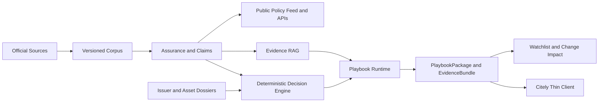

# Stablecoin Policy — Master Development Plan

Status: active execution plan  
Product: Stablecoin Policy public subsite and Citely stablecoin domain backend  
Last updated: 2026-08-12
Canonical product spec: `docs/superpowers/specs/2026-07-31-stablecoin-policy-domain-api-development-spec.md`

## 1. Purpose

This document turns the formal product specification into an execution plan
that another coding agent can resume without reconstructing project history.
It records the current production baseline, remaining phases, dependencies,
quality gates, rollout rules, and the bootstrap decision that initial operation
will not depend on a human review team.

The formal spec remains the canonical product and data-model definition. This
master plan is the canonical execution order. When the plan records an accepted
decision that conflicts with older text in the formal spec, the implementing PR
must first update the formal spec and executable Quint model where applicable.

## 2. Product outcome

Stablecoin Policy will provide three connected product layers:

1. a public, official-source-backed stablecoin policy subsite;
2. a versioned regulatory-data and evidence API for humans and agents;
3. a private stablecoin Playbook Runtime that Citely calls to obtain a
   presentation-safe `PlaybookPackage` and `EvidenceBundle`.

Citely remains thin. It owns authentication, billing, entitlements, domain
routing, and generic rendering. Stablecoin Policy owns stablecoin-specific
source ingestion, claims, assurance levels, dossiers, deterministic rules,
actions, evidence assembly, package generation, and change impact.

The public subsite never exposes raw `DecisionRule` definitions,
`PlaybookAction` generation logic, customer facts, private reviewer records, or
paid package bodies.

## 3. Scope

### In scope

- official source ingestion, provenance, versions, provisions, and rights;
- public jurisdiction, source, coverage, update, and change APIs;
- provisional machine-assisted and optional human-reviewed assurance lanes;
- Evidence RAG with pinned index releases and citations;
- stablecoin, issuer, authorization, and deployment dossiers;
- eight versioned stablecoin playbooks;
- deterministic decisions, reason codes, actions, evidence, and artifacts;
- authenticated Citely package APIs;
- regulatory change monitoring and package impact;
- tests, evals, Quint models, CI, production cutovers, rollback, and operations;
- extraction of unrelated legacy AI, politician, donor, energy, and data-center
  modules after stablecoin product parity is established.

### Out of scope

- Citely main-site UI, identity, billing, or subscription implementation;
- AI Policy and future Web3 Policy implementation in this repository;
- replacing local legal counsel or presenting the service as legal advice;
- KYC, KYT, sanctions screening, Travel Rule messaging, custody, accounting,
  reserve verification, or market-data execution products;
- storing production corpora or frequently changing generated data in Git;
- exposing private decision graphs or customer-specific outputs publicly.

## 4. Architecture and dependency order

Dependency rules:

- immutable source identity and rights precede claims;
- claims and assurance metadata precede retrieval indexing;
- legal corpus and asset dossiers precede deterministic playbook decisions;
- deterministic decisions precede narrative explanation;
- packages pin corpus, index, rules, templates, and dossier versions;
- monitoring reopens or invalidates affected packages; it never silently
  rewrites historical packages;
- public policy feed delivery is independent of paid playbook readiness and can
  ship earlier.

## 5. Current production baseline

### Phase 0 — complete

- provider-neutral report metadata and immutable-object interfaces;
- file-backed compatibility adapters;
- initial PostgreSQL schema and RLS;
- JSON Schema, unit-test, typecheck, and security-eval foundations;
- existing report, x402, and Alipay behavior preserved.

### Phase 1 — complete and deployed

- Supabase PostgreSQL and Storage adapters;
- immutable report and dataset releases with checksums;
- backfill, dual-read, strict parity, cutover, restore, and rollback;
- cached loaders with bounded stale behavior;
- production workflows publish to Storage instead of growing Git;
- private report and dataset buckets;
- production Vercel runtime reads from Supabase;
- warm-stale, cold-start, stale-expiry, checksum, encryption, and paid fail-closed
  rehearsals passed.

### Phase 2 technical infrastructure — complete through migration `0019`

- shared `regulatory` schema and Stablecoin-specific `policy` schema;
- immutable source documents, versions, provisions, and retrieval provenance;
- commercial storage-rights and excerpt-rights gates;
- source verification, claim review, corpus release, and coverage workflows;
- claim-draft import, preflight, baseline readiness, and review queue;
- deterministic Regulatory Event and Change Impact candidate pipeline;
- reviewed-only public `/v1/coverage`, `/v1/sources/{id}`, and `/v1/changes`;
- migrations `0001` through `0019` applied to production;
- database lint, production smoke, metadata backup, pgTAP, eval, and Quint gates
  passed at the 2026-08-01 checkpoint.

### Current production data state

- the original reviewed-only lane remains empty and continues to report
  `IN_PROGRESS`; no machine output has been mislabeled as human reviewed;
- the separate provisional lane publishes 47 EEA MiCA claims and 98 Singapore
  Payment Services Act/Regulations claims through versioned releases;
- EEA and Singapore provisional coverage is live at
  `/v1/provisional/coverage`, with explicit `PROVISIONAL` review status,
  `asOf`, knowledge cutoff, release identity, and limitations;
- Hong Kong core Cap. 656 remains blocked by an official archive identity
  mismatch and cannot support a complete Hong Kong baseline;
- the Vercel production `/v1/coverage`, `/v1/provisional/coverage`,
  `/v1/changes`, `/v1/policy-feed`, playbook catalog, and OpenAPI routes work;
- `https://policy.citely.info` is the documented production domain API base
  URL and serves the domain API, but its OpenAPI response does not yet expose
  the strict request-contract description added in PR #55; confirm that the
  custom domain is pinned to the latest `main` deployment before cutover;
- a legacy 37-chunk EEA retrieval index exists only as an inactive `DRAFT`;
  no Evidence RAG index is active in production;
- migration `0030` package persistence, the private `policy-playbooks` bucket,
  signed-auth configuration/cutover, and the first real immutable package
  smoke are not yet recorded as completed production rollout steps.

### Current repository quality baseline

At the latest merged checkpoint (`main` `839fd7d`, 2026-08-12):

- 209 Node tests passed;
- Phase 0 evals passed 4/4;
- Phase 1 evals passed 11/11;
- Phase 2 evals passed 89/89;
- all Phase 3 retrieval eval metrics passed: Recall@10, MRR@10, citation
  precision, version isolation, and index-build gate accuracy were `1.0`, with
  zero unauthorized-evidence, rights, or prompt-injection leaks;
- the isolated Supabase job applies the full repository migration chain and
  passes 238 pgTAP assertions, including package persistence;
- Phase 2, Evidence RAG, and PlaybookPackage Quint typechecks, scenarios,
  invariants, and witnesses passed;
- lint, typecheck, build, repository data checks, dependency audit, GitHub
  `quality`, isolated database CI, and Vercel deployment passed.

Treat these counts as a regression floor, not a permanent target. New behavior
must add tests and may increase the totals.

## 6. Accepted bootstrap assurance policy

Initial launch will not depend on assembling a human legal-review team. Human
review remains available as a higher-assurance path, but it is not the only way
to publish useful policy research or operate the first playbook experience.

The implemented assurance ladder is:

| Assurance level | Meaning | Bootstrap availability |
|---|---|---:|
| `SOURCE_OBSERVED` | immutable official material acquired | yes |
| `SOURCE_VALIDATED` | identity, version, checksum, locator, and rights checks pass | yes |
| `AI_EXTRACTED` | machine-generated structured claim with citations | yes, labeled |
| `AI_CROSS_CHECKED` | independently checked by models and deterministic validation | yes, provisional |
| `HUMAN_REVIEWED` | qualified person approved the exact version | later/optional |

The approved `machineAssurance.qnt` model and migrations `0020`–`0022` implement
these as a physically separate lane. Existing `VERIFIED`, reviewed-release,
and reviewed-coverage semantics retain their named-human meaning; provisional
publication cannot satisfy or overwrite those gates.

Bootstrap outputs must include:

- `assuranceLevel`;
- `reviewStatus`;
- confidence and blocking reasons;
- `asOf`, knowledge cutoff, and source versions;
- exact citations and canonical official URLs;
- limitations and explicit counsel triggers.

Machine-assisted output may provide findings, evidence, uncertainty, and next
actions. It must not represent an unreviewed result as a definitive legal
permission, guarantee compliance, or hide contradictory, stale, or missing
evidence. Ambiguous or unsupported branches return a typed provisional,
undetermined, or counsel-review state.

Reviewer Registry and scoped reviewer authorization are deliberately deferred.
The future plan is recorded in GitHub Issue
`web3yaso/stablecoin-policy#35` and begins only when an external reviewer,
enterprise credential requirement, or `HUMAN_REVIEWED` commercial tier exists.

## 7. Delivery roadmap

## Phase 2A — legal-corpus infrastructure

Status: complete and deployed.

No further feature work belongs in Phase 2A. Only production defects,
security fixes, or migration corrections should modify migrations `0003`
through `0019`; forward changes use new migrations.

Exit evidence:

- production migration history matches `0001`–`0019`;
- public/private permission boundaries pass;
- transaction rollback and stale-fingerprint behavior pass;
- production business data was unchanged by the final cutover.

## Phase 2B — provisional assurance and launch-market baseline

Status: bootstrap scope complete and deployed. The machine-assurance ladder,
EEA and Singapore provisional baselines, public claim lookup, and provisional
coverage are live. Hong Kong remains truthfully blocked; optional
`HUMAN_REVIEWED` upgrades are not a bootstrap dependency.

Goal: make high-quality, explicitly provisional regulatory intelligence usable
without weakening or impersonating the existing human-reviewed lane.

### Specification first

- update the formal spec to replace human review as a universal bootstrap gate;
- use the Quint modeling skill to define machine-assurance states, permitted
  transitions, publication visibility, and fail-closed behavior;
- preserve the human-reviewed path as an independent assurance upgrade;
- define which public and paid outputs may consume each assurance level;
- define the boundary between provisional findings and definitive permission;
- add invariants preventing machine evidence from being labeled
  `HUMAN_REVIEWED` or satisfying human-only gates;
- obtain explicit approval for the spec delta before database or API code.

### Data and workflow delivery

- add forward-only migrations for machine-validation audit records and
  assurance snapshots;
- record deterministic source-identity, checksum, locator, rights, freshness,
  and version checks;
- import AI-extracted claim candidates as private drafts with exact citations;
- run an independent cross-check pass for entailment, contradiction, effective
  dates, jurisdiction, and source-version correctness;
- store model, prompt/template, parameters, input fingerprints, output
  fingerprints, confidence, and failure reasons for reproducibility;
- publish provisional claims only through an explicit atomic path;
- keep provisional and human-reviewed corpus releases distinguishable;
- expose assurance and limitations in every public or paid response;
- prevent provisional publication from advancing reviewed coverage or
  overwriting historical reviewed releases.

### Launch-market baseline

- build EEA MiCA baseline claim bundles from the stored provisions;
- build Singapore Payment Services Act and Regulations baseline bundles;
- keep Hong Kong incomplete until the official Cap. 656 identity issue is
  resolved or an independently authoritative source is approved;
- define a versioned checklist per jurisdiction, even when the initial output
  is provisional;
- record explicit missing-topic and missing-source blockers;
- publish coverage as provisional or incomplete rather than reporting false
  `100%` reviewed completeness;
- ensure every claim can be reproduced from its source version and `asOf` date.

### Phase 2B evals

- source identity and version fixtures;
- claim entailment and contradiction fixtures;
- effective-date and jurisdiction fixtures;
- independent-model disagreement cases;
- stale, missing, rights-blocked, and superseded source cases;
- prompt-injection and malicious source-text cases;
- assurance-label and public-boundary privacy cases;
- replay determinism and fingerprint-change cases;
- machine-to-human escalation cases;
- proof that provisional evidence cannot satisfy human-reviewed invariants.

### Phase 2B exit

- EEA and Singapore have reproducible provisional baselines with explicit
  completeness and limitations;
- Hong Kong accurately reports its unresolved source blocker;
- machine evidence is never mislabeled as human reviewed;
- provisional public/API output is versioned, cited, and schema validated;
- all Quint, unit, pgTAP, eval, lint, typecheck, build, and smoke gates pass;
- production rollback requires only pointer/view or forward migration changes,
  not destructive data removal.

## Phase 2C — Citely public integration and API operations

Status: the minimum Citely policy-feed contract is implemented and deployed as
PR #36. `https://policy.citely.info/v1/policy-feed` serves schema `1.0.0` with
release-derived `generatedAt`, 77 official items at the rollout checkpoint,
ETag/304 behavior, OpenAPI, contract tests, and last-known-good semantics.
Cross-endpoint operational standardization, uptime/freshness alerting, and
ingestion-staleness monitoring remain.

### Simple policy feed

Implemented from the separate plan:

- `docs/superpowers/plans/2026-08-01-citely-policy-feed.md`

The feed is a thin projection of the existing active `news-summaries` release
and must provide `schemaVersion`, immutable release `generatedAt`, and flat
items containing `date`, `jurisdiction`, `summary`, `sourceUrl`, and optional
subsite-owned `playbookId`.

### API operational work

- add the policy feed to OpenAPI and contract CI;
- keep the canonical domain mapping and documented API base URL
  `https://policy.citely.info` aligned with Vercel production;
- standardize CORS, caching, ETag, stale headers, problem responses, request
  IDs, and schema-version headers across public APIs;
- add uptime and generated-time freshness monitoring;
- alert when ingestion or feed generation exceeds its stale threshold;
- document main-site last-known-good fallback behavior.

### Phase 2C exit

- Citely can consume one stable versioned policy feed without subsite-specific
  transformation logic;
- a deliberately stale fixture visibly retains its old `generatedAt`;
- a schema mismatch is rejected as a whole;
- production domain, Vercel route, OpenAPI, and contract all agree;
- no new ingestion or duplicated production dataset was introduced.

## Phase 3 — Evidence RAG

Status: foundation merged as PR #48 (`433ca8a`), activation gates as PR #50
(`ca5a21f`), and production eval assembly as PR #51 (`4ab895d`).
Playbook `EvidenceBundle` integration is merged as PR #52 (`2cc9ce5`).
The executable index/retrieval model, strict API contracts, provider-neutral
hybrid retrieval core, authenticated endpoint, pgvector-backed storage and
atomic index lifecycle migrations `0024`-`0025`, retrieval audit, sanitized
eval harness, and database tests are implemented. Migration `0026`
adds the default-dry-run EEA builder: service-only corpus input, deterministic
provision-aligned chunks, one-transaction/idempotent DRAFT import, immutable
chunk reuse, exact server-manifest inspection, and separately confirmed
activation. Migrations `0024`-`0026` are applied to the linked Supabase project.
The pre-build hotfix `0027` preserves an explicit provisional cutoff gap while
keeping human-reviewed time ordering strict and freshness bounded by both
timestamps. The activation-gates follow-up adds migration `0028`, an immutable
aggregate `RetrievalCorpusSnapshot`, exact private build-plan replay, production
DRAFT eval artifacts, and assurance-aware activation. A legacy 37-chunk
production DRAFT exists but remains inactive and is not grandfathered. The
intended replacement combines the two provisional source releases into a
deduplicated 47-claim snapshot. Production completion still requires applying
unapplied migrations `0028`–`0029`, building and evaluating the exact
replacement snapshot, then explicitly activating and replay-testing it. See
`docs/phase3-evidence-rag-operations.md`.

Goal: retrieve and explain exact regulatory evidence without allowing model
output to change deterministic decisions.

### Storage and indexing

- implement `EvidenceChunk`, `EmbeddingRecord`, `RetrievalIndexRelease`, and
  `RagRetrievalRun`;
- enable PostgreSQL full-text search and `pgvector` behind provider-neutral
  interfaces;
- chunk by legal structure and preserve provision, source version, locator,
  jurisdiction, topic, effective interval, rights, and assurance metadata;
- build immutable index manifests pinned to corpus releases;
- aggregate multiple immutable source releases through a snapshot whose exact
  source manifests and deduplicated claim membership are server-computed;
- call the embedding provider once, store the full plan outside Git with mode
  `0600`, and build only by replaying that exact checksum-pinned artifact;
- maintain separate filters or index visibility for provisional and
  human-reviewed evidence;
- never combine text from different source versions in one chunk.

### Retrieval and explanation

- implement hybrid lexical/vector retrieval;
- add structured filters, deterministic reranking, deduplication, and citation
  assembly;
- expose authenticated `POST /v1/evidence/search` and an internal Playbook
  Runtime interface;
- require sentence-level citations for material generated explanations;
- include assurance level and limitations with every retrieved item;
- return explicit low-confidence, stale-index, conflicting-evidence,
  unauthorized, and outage states;
- guarantee that disabling RAG cannot change deterministic result statuses or
  reason codes.

### Phase 3 quality gates

- gold provision Recall@10 at least 95%;
- MRR@10 at least 0.90;
- citation precision 100%;
- source/corpus/index version isolation 100%;
- prompt-injected instructions used as authority: zero;
- material unsupported explanations: zero;
- RAG outage changes deterministic decisions: zero;
- historical retrieval replay passes against pinned index releases.
- activation requires a passing eval for the current exact manifest;
- provisional indexes may use a documented independently cross-checked
  `MACHINE_ASSURED` eval, while human-reviewed indexes require a named
  `HUMAN_REVIEWED` eval.
- machine-assured gold datasets require different generator/checker identities,
  exact proposal and snapshot-manifest pins, case-level provision agreement,
  and full accepted checklist-topic coverage;

### Phase 3 exit

- aggregate snapshots and production-like indexes can be created, evaluated,
  activated, rolled back, and replayed;
- search returns exact citations and assurance metadata;
- Citely and playbook services can consume retrieval results through a stable
  contract;
- retrieval failure degrades explanation only, never the deterministic engine.

## Phase 4 — stablecoin, issuer, and deployment dossiers

Status: provisional USDC × EEA mini-dossier implemented; normalized persistent
dossier expansion and broader asset coverage remain.

Goal: add the asset-specific evidence required for Pre-listing decisions.

### Data model

- `Stablecoin` and aliases;
- `Issuer` and legal entities;
- `IssuerAuthorization` by jurisdiction and activity;
- native `Deployment`, contract address, chain, and verification source;
- `BridgeRelationship` and wrapped/synthetic representations;
- `ReserveDisclosure` and assurance reports;
- `RedemptionPolicy`;
- `AdministrativeControl`;
- `OperationalIncident`;
- dossier release, freshness, assurance, and provenance records.

### Initial dossiers

- default targets are USDC and USDT unless a design-partner decision changes
  them;
- verify issuer entities, official token lists, chain deployments, contracts,
  reserve disclosures, redemption terms, and material controls;
- distinguish issuer claims from regulatory authority;
- record missing, conflicting, or stale attributes explicitly;
- do not infer that an issuer authorization automatically covers every token,
  chain, deployment, activity, customer type, or jurisdiction.

### Public and private APIs

- `GET /v1/catalog/stablecoins`;
- `GET /v1/stablecoins/{id}`;
- `GET /v1/deployments/{id}`;
- internal version-pinned dossier lookup for the decision engine;
- public allowlists that exclude private review and commercial-only fields.

### Phase 4 evals and exit

- contract-address and chain identity fixtures;
- issuer/deployment relationship fixtures;
- wrapped/native/synthetic distinction cases;
- authorization scope and effective-date cases;
- reserve/redemption freshness and conflict cases;
- privacy and version replay cases;
- initial dossiers provide enough explicit, source-backed data to run a
  provisional Pre-listing case without inventing missing facts.

## Phase 5 — deterministic Playbook Runtime and Citely package API

Status: code-complete for the first sellable vertical slice; production
rollout remains. The deterministic runtime and two launch playbooks are merged
as PR #41, retrieval composition as PR #52, immutable artifact persistence and
replay as PR #53, Ed25519 target-bound Citely service authentication as PR #54,
strict consumer contracts/fixtures as PR #55, and the credential-safe signed
production replay smoke runner as PR #56. Vercel records a successful
Production deployment for `main` `839fd7d`, but the canonical custom-domain
alias still needs latest-contract alignment verification. Migration `0030`,
the private package bucket, production public-key configuration, signed-auth
cutover, and a real create/retrieve/render replay are not yet recorded as
complete.

Goal: deliver the first paid evidence-backed workflow while keeping Citely
domain agnostic.

### Runtime foundations

- implement normalized `BusinessProfile` and confirmed-input contracts;
- implement versioned `DecisionRuleRelease`, `ReasonCode`, and
  `PlaybookTemplateRelease`;
- implement deterministic capability-level evaluation;
- implement `PlaybookAction` generation with evidence or an explicit
  operational basis;
- implement `EvidenceBundle` assembly from pinned corpus, dossier, and retrieval
  releases;
- implement immutable `PlaybookPackage` artifacts in Storage with queryable
  metadata in PostgreSQL;
- enforce idempotency, authorization, replay, and customer-data minimization.

### First vertical slice

Build **Stablecoin Pre-listing & Product Launch** first for small exchanges,
wallets, and payment integrators.

Output includes:

- confirmed and missing input facts;
- capability matrix rather than one asset-wide answer;
- deterministic result and reason codes;
- assurance and review status;
- confidence, limitations, and blockers;
- generated operational actions;
- exact evidence and citations;
- counsel triggers for high-risk or unresolved decisions;
- corpus, index, dossier, rules, template, and schema versions;
- `asOf`, knowledge cutoff, evaluated time, integrity, and artifact reference.

During bootstrap, the package may be sold as evidence-backed regulatory
research and operational preparation without mandatory human review. It must be
visibly provisional when its evidence is not `HUMAN_REVIEWED` and must not claim
to be legal advice or definitive compliance clearance.

### Citely API

- `GET /v1/playbooks`;
- `GET /v1/playbooks/{id}`;
- authenticated `POST /v1/playbook-packages`;
- authenticated `GET /v1/playbook-packages/{id}`;
- signed, short-lived service authentication and entitlement assertion;
- idempotency keys and retry-safe package creation;
- presentation-safe schemas and consumer fixtures;
- no raw rules, private graphs, prompts, or unnecessary customer facts.

### Remaining playbooks

The Business Model Regulatory Boundary playbook launches with Pre-listing and
is already implemented. After the first production package proves the runtime,
add:

1. First-Jurisdiction Selection;
2. Entity and Licence Landing Path;
3. Issue vs White-label vs Integrate;
4. Funding and Regulatory Due-Diligence Room;
5. Multi-jurisdiction Expansion;
6. Stablecoin Listing Lifecycle Monitor.

Each playbook must reuse the common runtime and evidence contract rather than
creating a bespoke application path.

### Phase 5 evals and exit

- normalized-input and missing-fact cases;
- exact deterministic status/reason-code cases;
- action grounding and counsel-trigger cases;
- provisional versus human-reviewed assurance cases;
- package schema and Citely rendering fixtures;
- idempotent retry, authorization, privacy, and replay cases;
- RAG enabled/disabled/outage equality for deterministic results;
- at least one production-like Pre-listing package can be created, retrieved,
  rendered by a generic client, and replayed from pinned versions.

Consumer-fixture checkpoint (2026-08-12): the strict
`playbook-package-create-request` schema rejects unknown customer fields,
duplicates, and empty identifiers. Sanitized deterministic request/response
pairs cover both launch playbooks, successful RAG, and typed RAG outage. CI
regenerates them in memory, validates request/response schemas and package
integrity, resolves every referenced claim, and proves a generic projection
retains assurance, limitations, counsel triggers, capability-level results,
citations, retrieval state, and version pins without branching on stablecoin
domain values. This closes the local consumer-fixture criterion; a deployed
signed create/retrieve/render replay remains the production-like exit gate.

Public-detail checkpoint (2026-08-14): `GET /v1/playbooks/{id}` now returns
presentation-safe catalog metadata and a directly renderable JSON Schema
2020-12 intake contract. The committed response schema, route tests, and
OpenAPI discovery prove that Citely can build a generic intake without
hardcoding stablecoin fields, while privacy tests keep raw rules, dossier
checks, generated actions, prompts, private graphs, and evidence topics behind
the paid runtime boundary.

Replay-smoke checkpoint (2026-08-12): PR #56 (`839fd7d`) adds a
Citely-secret-bound runner for the
remaining production-like package gate. It mints exact five-minute Ed25519
entitlements in memory and checks create, exact retry, changed-request
conflict, target denial, audience rejection, expiry rejection, authenticated
replay, response schema, package integrity, artifact equality, and generic
render readiness without printing credentials or the artifact. It creates a
real immutable package only when explicitly invoked; CI uses mocked transport
and no production key or endpoint. Applying migration `0030`, configuring
public keys, deploying, and invoking the smoke remain rollout actions.

## Phase 6 — monitoring, subscriptions, and controlled self-service

Status: event/impact candidate infrastructure exists. Package dependency
indexing was merged as PR #63 and immutable package-derived watchlists were
merged as PR #64. The pull-based Change-to-Action Delta slice was merged as PR
#65 and the first webhook delivery slice as PR #66. The superseding-evaluation
implementation is in PR #67. Production migrations `0031`–`0035` were applied
in order on 2026-08-20 against an empty package/event monitoring state after
private backups and a linked dry-run. Receiver configuration, scheduler
activation, PR #67 application deployment, and signed end-to-end smoke remain
rollout work; no production change event may be published before those gates.

### Monitoring graph

- connect source-version diffs to claims, rules, dossiers, packages, and
  watchlists;
- preserve at-least-once cursor semantics and deduplication;
- compute candidate impacts automatically;
- distinguish machine-suggested, provisional, and reviewed impact states;
- reopen affected packages or create immutable superseding evaluations;
- never mutate historical package conclusions in place.

Package-impact checkpoint (2026-08-14): package persistence now validates that
the `EvidenceBundle.claims` set exactly equals the claim IDs referenced by
capability conclusions, then registers those edges in the same PostgreSQL
transaction as package metadata and idempotency completion. Candidate events,
pending/dismissed impacts, unrelated claims, non-corpus claims, duplicate
dependencies, and public/browser access all fail closed. The implementation
does not index retrieval-only hits because RAG cannot alter deterministic
decisions.

Package-watchlist contract approved (2026-08-14): one completed package with a
non-empty immutable decision-evidence dependency set may create one immutable
`ACTIVE` watchlist. Creation is idempotent by package and uses the existing
exact-package `playbook:read` Citely entitlement. The subsite stores no
customer, subscription, entitlement, profile, or delivery destination. A
private impact lookup may identify the watchlist only for a `PUBLISHED` event
and a matching `REVIEWED` claim impact. Lifecycle transitions, deltas,
superseding evaluations, and webhook delivery remain separate later slices.

Package-watchlist implementation checkpoint (2026-08-14): branch
`codex/package-watchlists` adds migration `0032`, an executable Quint model,
strict TypeScript parsing, authenticated bodyless creation API, JSON Schema,
OpenAPI discovery, and pgTAP/route/entitlement tests. Local migration-from-zero
through `0032`, all nine Quint scenarios, five invariants, nine witnesses, and
29 watchlist pgTAP assertions pass. Production migrations `0031`/`0032`, signed
endpoint smoke, change-to-action deltas, lifecycle transitions, and delivery
remain separate rollout or development work.

Change-to-Action Delta contract approved (2026-08-16): a newly `PUBLISHED`
event with a `REVIEWED` impact on an active watchlist package's exact immutable
decision-evidence claim dependency creates one immutable
`REVIEW_REQUIRED` delta per `(watchlist,event)`. The delta freezes the event,
package assurance, and canonical claim impacts; it never mutates the old
package or infers a new legal conclusion. The first fixed operational actions
are `REVIEW_EVIDENCE_CHANGE` and `REQUEST_PLAYBOOK_RERUN`, with required
customer response `ACKNOWLEDGE_AND_RERUN`. Citely polls with the existing exact
package `playbook:read` entitlement and advances an opaque package/watchlist-
bound cursor only after durable processing. Webhook/email delivery, automatic
reruns, superseding evaluations, and counsel thresholds remain later product
contracts.

Change-to-Action Delta implementation checkpoint (2026-08-16): branch
`codex/change-to-action-deltas` adds migration `0033`, atomic publication-time
materialization, immutable delta and reviewed-impact snapshots, a bounded
service-only cursor RPC, executable Quint model, strict TypeScript cursor and
response parsing, authenticated `GET
/v1/playbook-packages/{id}/watchlist/changes`, JSON Schema, OpenAPI, and
pgTAP/route/entitlement tests. Local migration-through-`0033`, 11 Quint
scenarios, seven invariants, nine witnesses, and 36 delta pgTAP assertions
pass. PR #65 merged the slice on 2026-08-17. Production migrations `0031`–
`0033`, deployment, and signed smoke remain separate checkpoints.

Webhook delivery checkpoint (2026-08-17): branch
`codex/change-delta-webhooks` adds migration `0034` with a transactional outbox,
bounded leases/retries, immutable attempt and replay audit, service-only
claim/complete/audit/replay RPCs, and recovery for expired worker leases. One
deployment-level Citely URL and HMAC secret remain server environment values,
so the domain database stores no customer, destination, or secret. A protected
uncached Vercel cron route sends the strict versioned delta envelope with
`deltaId` as its stable at-least-once deduplication identity. The executable
Quint model has 13 scenarios, nine invariants, and nine witnesses; migration
tests add 44 pgTAP assertions. Production receiver setup, migration, secrets,
schedule selection, deployment, and signed smoke remain rollout work.

Superseding-evaluation contract approved (2026-08-19): Citely explicitly
resubmits the original Business Profile and exact current pending delta set for
one base package. The profile fingerprint must match the immutable base package;
a changed profile is a normal new package, not a rerun. A new delta appearing
during evaluation makes completion stale and requires a refreshed request
fingerprint over the full snapshot. Success atomically creates one immutable
successor, records lineage and exact delta coverage, supersedes the old
watchlist, and activates the successor watchlist. Exact replay returns the same
successor; webhooks never trigger a rerun automatically. The executable Quint
model and 14 scenarios are complete; see
`docs/superpowers/plans/2026-08-19-superseding-playbook-evaluations.md`.

Superseding-evaluation implementation checkpoint (2026-08-20): migration
`0035` adds private rerun attempts, immutable package lineage and exact delta
coverage, a controlled `ACTIVE` to `SUPERSEDED` transition, and claim/completion
RPCs that serialize with delta materialization. Authenticated `POST
/v1/playbook-packages/{id}/rerun` requires a signed `playbook:execute` token
targeting both the exact playbook and base package; the legacy unscoped key is
rejected. It reuses the deterministic runtime and unchanged artifact response,
stores no raw profile, and returns typed stale/idempotency conflicts. Local
migrations through `0035`, 34 new and 409 total pgTAP assertions, request/token
contracts, route/store/auth tests, and the Quint gate pass. Later on 2026-08-20,
production migrations `0031`–`0035` were applied after private backups and a
linked dry-run; migration history and database lint pass, normalized business
data is unchanged, and every new monitoring table is empty. Receiver secrets,
scheduler activation, application deployment, and signed smoke remain open.

Monitoring-eval checkpoint (2026-08-24): branch
`codex/phase6-monitoring-eval` turns the formal known affected-package recall
and critical-miss thresholds into an executable per-scope CI gate. The
versioned sanitized dataset covers both MVP playbook scopes and the exact
published-event, reviewed-impact, immutable claim-dependency, and active-
watchlist boundary. The deterministic report includes recall, critical
misses, false positives, exact-case accuracy, stable dataset identity, and
explicit limitations. Passing this isolated monitoring gate does not activate
broad self-service or replace source, retrieval, deterministic-rule, privacy,
assurance, contract, or release gates. See
`docs/superpowers/plans/2026-08-24-phase6-monitoring-eval.md`.

### Customer delivery

- implement watchlist creation from completed packages; implemented in PR #64;
- expose change-to-action deltas to Citely; merged in PR #65 as a cursor-based
  pull API, pending production rollout;
- use webhook as the first notification channel; merged in PR #66 for one
  deployment-level Citely receiver;
- sign webhook payloads, retry safely, and provide delivery audit; merged with
  migration `0034` and the protected cron dispatcher;
- include affected package, evidence change, status, actions, assurance, and
  required customer response;
- add notification throttling, deduplication, and replay; bounded batch claims,
  stable `deltaId`, and service-authorized replay are implemented locally.

### Controlled self-service

- collect production error and correction cases as regressions;
- measure decision, action, retrieval, and monitoring quality by supported
  jurisdiction/asset/capability combination;
- enable self-service only for combinations meeting all current gates;
- keep unsupported combinations typed and blocked;
- introduce optional human-reviewed commercial tiers when reviewers exist;
- implement Reviewer Registry only after Issue #35 activation criteria are met.

### Phase 6 exit

- a material source change identifies affected packages and watchlists;
- Citely receives an idempotent, evidence-backed change delta;
- critical monitoring recall meets the formal threshold;
- self-service scope is explicit, versioned, and reversible;
- unsupported scope never falls through to a confident answer.

## Phase 7 — legacy-domain extraction and repository focus

Status: complete and deployed. PR #47 (`ba52afd`) passed Preview and production
smoke on 2026-08-08, and GitHub Issue #46 is closed.

Goal: leave this repository focused on Stablecoin Policy without breaking the
public site or shared data needed by AI Policy.

### Inventory and dependency mapping

- identify AI, politician, donor, election, energy, and data-center routes,
  data, scripts, components, tests, and imports;
- classify each item as stablecoin-required, cross-domain reusable,
  AI-Policy-owned, archive-only, or removable;
- map URLs, search traffic, and redirect requirements;
- identify shared official documents that belong in the shared `regulatory`
  substrate rather than either product repository.

### Extraction

- migrate reusable AI materials through shared data interfaces or the AI Policy
  project;
- preserve licence, provenance, version, and rights metadata;
- add redirects before removing public routes;
- remove orphaned scripts, packages, data, components, and tests in small PRs;
- do not rewrite Git history as part of ordinary extraction;
- preserve stablecoin public APIs and paid endpoints throughout.

### Phase 7 exit

- no production stablecoin route imports unrelated legacy modules;
- AI Policy owns its domain UI and analysis while sharing canonical official
  evidence where appropriate;
- repository-data limits and build output materially improve;
- redirects, analytics, tests, and rollback checks pass.

Implementation record: `docs/phase7-legacy-domain-cleanup.md` is the approved
disposition inventory, redirect plan, before/after measurement, verification
record, and rollback handoff for GitHub Issue #46. The cleanup removes legacy
AI/data-center, politician, donor, vote, energy/EIA product code and generated
data while preserving Stablecoin APIs, shared regulatory storage, and the
machine-assurance lane. Build output fell from 65 to 23 generated app pages and
tracked bytes fell by 79.7%. Preview and post-merge production smoke passed.

## 8. Cross-phase engineering workstreams

### Contracts and compatibility

- every public, Citely, MCP, and webhook payload has an immutable major-version
  JSON Schema;
- unknown or unsupported schema versions fail atomically;
- OpenAPI matches runtime behavior;
- breaking changes create a new major contract;
- Citely consumer fixtures run in subsite CI;
- old report and payment routes remain compatible until an explicitly approved
  retirement.

### Storage and data integrity

- Git stores code, schemas, migrations, small fixtures, and manifests only;
- PostgreSQL stores queryable relationships and metadata;
- Storage holds immutable raw sources and complete artifacts;
- every object has checksum, type, size, version, and provenance;
- no object is overwritten in place;
- no production data is duplicated across Git paths or policy-domain repos;
- every cutover has backup, dry run, post-snapshot, and pointer-based rollback.

### Security and privacy

- separate public, service, reviewer, and admin authorization scopes;
- deny direct service-role writes where controlled RPCs own transitions;
- encrypt customer facts and minimize retention;
- never log complete customer facts, secrets, decrypted reports, or package
  bodies;
- use private buckets and short-lived signed URLs;
- maintain public-view allowlists and privacy evals;
- treat source text and retrieved content as untrusted data;
- keep reviewer PII and credentials private if Reviewer Registry is later built.

### Rights and provenance

- commercial internal-storage rights and public excerpt/redistribution rights
  remain separate;
- rights-blocked artifacts are not uploaded;
- link-only material does not become mirrored content;
- research is labeled separately from legal authority;
- corrections create new immutable versions;
- every material output identifies source version, locator, and assurance.

### Observability and operations

- monitor ingestion success, source health, release freshness, cache state,
  schema failures, API latency, retrieval quality, package creation, and
  notification delivery;
- expose data generation time rather than request time;
- alert on source/feed staleness before users discover it;
- retain request IDs and structured, privacy-safe error logs;
- document operational commands, expected output, rollback, and escalation;
- exercise cold-start and degraded-mode behavior before major cutovers.

## 9. Evaluation strategy

### PR gates

- lint and typecheck;
- unit and contract tests;
- deterministic evals;
- applicable Quint typecheck, scenarios, invariants, and witnesses;
- pgTAP for migrations, permissions, triggers, and RPC atomicity;
- privacy and rights tests;
- build and repository data-size checks;
- fixed fixtures only; no required live network.

### Nightly gates

- live official-source health;
- source discovery recall and drift;
- feed and dataset freshness;
- retrieval quality and index drift;
- monitoring replay;
- dependency and security audit;
- production read-only smoke.

### Release gates

- versioned eval report;
- database migration dry run from zero and against linked history;
- private pre-cutover metadata backup;
- permission and public-boundary audit;
- OpenAPI and consumer contract verification;
- Vercel preview smoke;
- production deployment and read-only smoke;
- post-cutover normalized snapshot comparison;
- documented rollback result.

### Non-negotiable quality thresholds

- required evidence metadata: 100%;
- material citation traceability: 100%;
- contradictory evidence in a confident output: zero;
- critical deterministic cases: 100%;
- repeated pinned-run equality: 100%;
- public leakage of private rules/customer data/reviewer data: zero;
- retrieval citation precision and version isolation: 100%;
- known critical monitoring event missed: zero;
- missing or stale material evidence producing certainty: zero;
- machine output mislabeled as human reviewed: zero.

## 10. Branch, PR, and checkpoint policy

- start each bounded capability from current `main` on a `codex/` branch;
- keep schema/model, migration, repository/client, route, tests, and docs for one
  capability in the same PR when they form one atomic contract;
- create a Git checkpoint before beginning a separate storage or state-machine
  migration;
- do not mix unrelated cleanup with feature or cutover work;
- do not commit `docs/PROJECT_CONTEXT.md`; it is a local index;
- do not modify or delete unrelated user work in a dirty tree;
- require passing CI and resolved review feedback before merge;
- merge in dependency order and update this plan after each completed phase;
- record production migrations and smoke evidence in the formal spec and local
  context.

## 11. Immediate execution order

**Vertical-slice decision (2026-08-01):** the fastest path to the first
sellable playbook takes priority over full phase completion. Do not wait for
all of Phase 3 and Phase 4; build one minimal vertical slice — EEA provisional
baseline → USDC×EEA mini-dossier → Pre-listing MVP → first `PlaybookPackage` +
`EvidenceBundle` delivered to Citely — then widen. The Phase 2B exit
conditions in section 7 still define full phase completion; the slice is an
intermediate sellable milestone, not a replacement for them.

1. ~~commit the master plan and policy-feed plan as a documentation
   checkpoint~~ — done 2026-08-01;
2. ~~implement and deploy the simple `/v1/policy-feed` quick win~~ — merged
   as PR #36 and deployed 2026-08-02; production smoke passed: schemaVersion
   `1.0.0`, `generatedAt` equals the active `news-summaries` release
   (`2026-08-01T06:14:09.810Z`), 77 official items, ETag/304 verified;
3. ~~write and approve the Phase 2B provisional-assurance spec delta and Quint
   model~~ — implemented in `specs/machineAssurance.qnt` and migrations
   `0020`–`0022`;
4. ~~build and publish the reproducible EEA MiCA provisional baseline~~ — 47
   claims live; Singapore also has 98 provisional claims;
5. keep Hong Kong truthfully blocked and defer Cap. 656 until authoritative
   identity is resolved;
6. ~~complete Phase 4 Mini with only the USDC issuer/deployment dossier fields
   consumed by the EEA Pre-listing decision~~ — merged as PR #40;
7. ~~complete the Phase 5 MVP code for the Pre-listing and Business Model
   Regulatory Boundary launch playbooks~~ — runtime, persistence, signed auth,
   consumer fixtures, and smoke tooling are merged through PR #56;
8. keep `https://policy.citely.info` as the canonical domain API base URL and
   verify its alias serves the latest `main` contract before cutover;
9. **current production gate:** back up metadata, dry-run/apply migration
   `0030`, verify the private `policy-playbooks` bucket, configure the Citely
   public-key map, deploy in dual-auth mode, and run
   `npm run smoke:citely-playbook` from the Citely secret boundary;
10. after signed POST/GET smoke passes, require signed tokens, verify legacy
    rejection, and remove shared keys after the rollback window;
11. integrate Citely entitlement and generic rendering, then complete one real
    production create/retrieve/render replay before the first sale;
12. build/evaluate/activate the replacement 47-claim Evidence RAG snapshot;
13. **widen after first sale:** USDT and normalized dossiers, remaining
    playbooks, and broader market coverage;
14. connect packages to Phase 6 monitoring, watchlists, and delivery;
15. ~~extract unrelated legacy modules in Phase 7~~ — PR #47 deployed and
    Issue #46 closed.

Parallel work is allowed only when contracts and database ownership do not
overlap. RAG must not begin production implementation before the MVP package
contract is stable; the MVP explicitly does not depend on RAG — evidence
assembly uses direct claim/citation lookups from the provisional corpus.

## 12. Resolved and remaining product decisions

Resolved:

- Phase 2B machine-assurance state names, transitions, and publication gates
  are fixed by the approved Quint model and migrations `0020`–`0022`;
- Phase 5 Citely service authentication uses five-minute Ed25519 JWTs with one
  exact scope and playbook/package entitlement target;
- the two launch playbooks are Pre-listing and Business Model Regulatory
  Boundary, sharing the EEA provisional baseline and common runtime;
- bootstrap packages may be sold as visibly provisional regulatory research
  without implying human review or legal advice.

Still required before their dependent rollout:

- Phase 2B/4: confirm whether EEA, Singapore, Hong Kong, USDC, and USDT remain
  the post-MVP widening scope;
- Phase 5: set package pricing, retention, and customer-facing limitation text.
- Phase 6: select webhook, email, or both for the first notification channel.
- Phase 6: define product thresholds for `CONDITIONAL`, `UNDETERMINED`, and
  mandatory counsel escalation.

Use explicit `UNDECIDED` or unsupported states until these choices are made;
do not fill gaps through model inference.

## 13. Master definition of done

Stablecoin Policy reaches the planned product outcome when:

- the public subsite exposes current, versioned, official-source-backed policy
  intelligence with visible freshness;
- Citely consumes standard feeds and package APIs without stablecoin-specific
  domain logic;
- EEA and Singapore baselines and initial USDC/USDT dossiers are reproducible
  from exact source versions, with Hong Kong accurately scoped to available
  authority;
- Evidence RAG retrieves precise, version-isolated citations and cannot change
  deterministic decisions;
- Pre-listing produces an immutable, evidence-backed, replayable package with
  explicit assurance, uncertainty, actions, and counsel triggers;
- change monitoring identifies affected packages and sends idempotent deltas;
- bootstrap operation works without a mandatory human review team while never
  misrepresenting machine output as reviewed legal advice;
- optional human assurance can be added later without redesigning the evidence
  or package model;
- all public/private boundaries, quality thresholds, rollback exercises, and
  production smokes pass;
- unrelated legacy domains no longer burden the stablecoin product runtime.

## 14. Agent handoff procedure

Every coding agent continuing the project must:

1. read `AGENTS.md` and `docs/PROJECT_CONTEXT.md` first;
2. read this master plan and the formal development spec;
3. follow any phase-specific plan linked from this document;
4. inspect `git status`, current branch, recent commits, migrations, and deployed
   state before assuming the checkpoint described here is unchanged;
5. read the relevant Next.js 16 documentation before editing Next.js code;
6. use Quint before coding any new state machine or modifying a modeled one;
7. use forward-only migrations and preserve existing immutable audit records;
8. update tests, evals, OpenAPI, operations docs, formal spec, this plan, and
   local context when behavior changes;
9. run the complete quality gate appropriate to the phase;
10. report exact remaining blockers and production state instead of describing
    implementation completion as product-data completion.
