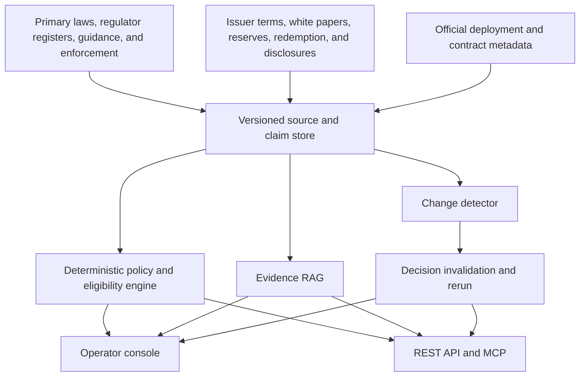
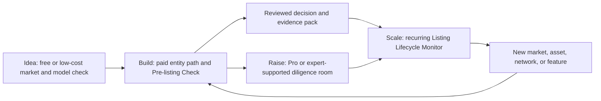

# Stablecoin Regulatory Intelligence, Stage Playbooks & Pre-listing Check — Design

**Date:** 2026-07-30  
**Status:** Proposed  
**Scope:** Evolve the existing jurisdiction-level stablecoin policy tracker into a source-backed regulatory intelligence product; package it as stage-aware playbooks; then add a human-reviewed Pre-listing Check and continuous monitoring for small exchanges, wallets, payment integrators, AI agents, and data products.

## 1. Executive summary

The current product tracks stablecoin policy at the jurisdiction level. It can describe a market's legal status, regulatory regime, issuer eligibility, reserve policy, consumer protection, cross-border treatment, regulators, legislation, and recent news.

It does **not** currently contain the asset-level data needed to decide whether a specific stablecoin deployment should be listed or supported. Missing domains include issuer identity, jurisdiction-specific issuer authorization, chain and contract identity, native versus bridged status, reserve disclosures, redemption eligibility, administrative controls, and operational incident history.

The product will therefore evolve in layers:

1. **Jurisdiction Policy Intelligence** — make the existing policy corpus queryable, time-aware, source-backed, and available through APIs.
2. **Asset & Issuer Intelligence** — add stablecoin, issuer, deployment, reserve, redemption, and administrative-control data.
3. **Pre-listing Check** — combine an operator's business profile with policy and asset evidence to produce a capability-level eligibility matrix.
4. **Change-to-Action Monitoring** — detect source changes, identify affected claims and decisions, rerun checks, and notify customers with concrete actions.

These layers are packaged for customers as a four-stage playbook portfolio:

1. **Idea** — validate the regulatory boundary and select a first market.
2. **Build** — choose an entity and licence path, then run Pre-listing and product-launch checks.
3. **Raise** — compare issuing, white-labelling, and integrating; assemble a regulatory due-diligence room.
4. **Scale** — expand to new markets and continuously monitor listing eligibility.

The jurisdiction API is the underlying intelligence service, not the complete customer product. The playbooks preserve business context, guide users through decision nodes, call the policy and evidence services, generate reusable artifacts, and subscribe completed decisions to future changes.

The product is not a general stablecoin chatbot. Its core output is a versioned, reproducible **decision object**. RAG retrieves and explains evidence; a structured rule and review layer determines machine-readable statuses.

Proposed positioning:

> For a specified legal entity, customer group, business activity, stablecoin deployment, jurisdiction, and date, return which product capabilities may be offered, under what conditions, what remains uncertain, and which source passages support the result.

## 2. Target customers and jobs

### 2.1 Small exchanges, wallets, and payment integrators

These customers need to:

- screen a new market before paying for full legal advice;
- determine whether to support a stablecoin and which product capabilities to enable;
- distinguish buy, sell, custody, transfer, deposit, withdrawal, swap, merchant payment, payout, redemption, and rewards;
- understand issuer, reserve, redemption, and administrative-control risks;
- generate an evidence pack for founders, external counsel, banking partners, and engineers;
- monitor changes that may require a feature flag, disclosure, geo-block, or customer notice;
- preserve the facts and evidence used for an earlier listing decision.

The product supports research, triage, and internal decision records. It does not replace qualified legal counsel.

### 2.2 AI agents and data product developers

These customers need to:

- enrich products with normalized jurisdiction policy and stablecoin metadata;
- request a deterministic eligibility result rather than an unstructured essay;
- retrieve evidence with exact source locators;
- consume daily deltas instead of repeatedly downloading the whole corpus;
- pin a corpus and engine version for historical reproduction;
- distinguish unsupported coverage from a negative result;
- retry paid calls without double charging;
- discover and call the service through OpenAPI, MCP, and x402;
- estimate cost before invoking an expensive check.

## 3. Product boundary

### 3.1 What the current corpus supports

The current repository contains:

- jurisdiction-level legal and regulatory status;
- stablecoin policy tags for issuance, reserves, consumer protection, cross-border treatment, and monetary sovereignty;
- allowed stablecoin types;
- selected practitioner questions such as issuance, foreign stablecoins, reserves, algorithmic stablecoins, and yield;
- regulator metadata;
- legislation and policy events;
- news and generated reports;
- report discovery and x402 payment infrastructure.

Relevant current files:

- `types/index.ts`
- `data/international/*.json`
- `data/legislation/**/*.json`
- `data/news/summaries.json`
- `lib/search.ts`
- `app/openapi.json/route.ts`
- `app/api/reports/[slug]/route.ts`

### 3.2 What must be added for Pre-listing Check

The new corpus must add:

- stablecoin and issuer identities;
- issuer legal entities by market;
- regulator registers, approvals, white papers, and authorization history;
- official chain deployments and contract addresses;
- native, bridged, and wrapped relationships;
- decimals and token standards;
- mint, burn, pause, freeze, blocklist, and upgrade controls;
- reserve composition and assurance history;
- redemption eligibility, geography, fees, limits, and timing;
- material depeg, freeze, redemption, migration, enforcement, and operational events;
- activity-level policy claims connected to specific evidence;
- decision and change history.

### 3.3 Explicit non-goals

The first version will not build:

- KYC or KYB;
- sanctions-list or PEP screening;
- wallet attribution or KYT;
- Travel Rule messaging;
- SAR or STR workflows;
- real-time trading or depeg terminals;
- liquidity routing;
- custody infrastructure;
- licence application management;
- automatic delisting without human approval;
- broad stablecoin news summaries as a paid core product;
- global coverage before the first markets are reliable;
- definitive legal advice.

Mature AML, wallet-screening, market-data, and custody providers may be integrated later as external signals.

## 4. Layered architecture



Key design rule:

> RAG retrieves and explains. Normalized claims, deterministic rules, and human review produce the status used by software.

## 5. Proposed MVP scope

### 5.1 Markets

Initial markets:

- European Economic Area;
- Hong Kong;
- Singapore.

These are proposed starting markets, not a commitment to equal completeness. The coverage endpoint must expose current completeness and freshness per market.

Later candidates:

- United Arab Emirates;
- United States;
- United Kingdom.

### 5.2 Stablecoins

Initial stablecoins:

- USDC;
- USDT.

Later candidates:

- EURC;
- PYUSD;
- RLUSD.

### 5.3 Networks

Prioritize official deployments relevant to the selected stablecoins, including where applicable:

- Ethereum;
- Base;
- Solana;
- Tron.

The corpus must not assume that every stablecoin exists on every network. Each deployment is independently verified.

Canonical asset identity:

```text
stablecoin_id + CAIP-2 chain_id + contract_address
```

Ticker-only identification is not accepted for a decision request.

### 5.4 Customer and activity scope

Initial customer types:

- retail individual;
- business or merchant;
- institutional.

Initial activities:

- `buy`
- `sell`
- `swap`
- `custody`
- `deposit`
- `withdrawal`
- `transfer`
- `merchant_payment`
- `payout`
- `redemption`

`rewards` and `yield` may be accepted as research questions but should default to counsel review until dedicated rule coverage is complete.

## 6. Primary user workflows

### 6.1 Pre-listing Check

1. User creates or selects a saved business profile.
2. User identifies the target stablecoin deployment.
3. System validates the stablecoin, network, and contract.
4. System retrieves the applicable jurisdiction, actor, customer, and activity claims.
5. System retrieves issuer, reserve, redemption, and administrative-control evidence.
6. The policy engine produces a status for each requested capability.
7. RAG explains each result and attaches exact evidence.
8. The system identifies missing facts and unresolved conflicts.
9. A reviewer approves, edits, or rejects the draft.
10. The system publishes an immutable decision version and optional report.

### 6.2 Change-to-Action monitoring

1. A monitored source publishes, amends, removes, or corrects information.
2. The system creates a new source version.
3. Changed source passages are mapped to affected claims.
4. Affected claims are marked for review.
5. Decisions depending on those claims are marked `needs_review`.
6. The system reruns the relevant checks against the new corpus version.
7. A reviewer confirms any status-changing result.
8. Customers receive a before/after notification and proposed actions.

### 6.3 Agent and data-product consumption

1. Client checks catalog and coverage for free.
2. Client normalizes asset, jurisdiction, actor, customer, and activity identifiers.
3. Client requests a quote or uses an account quota.
4. Client submits a deterministic policy check.
5. Client receives statuses, reason codes, citations, versions, and metering data.
6. Client retrieves full evidence only when required.
7. Client stores the immutable `decision_id` or `run_id`.
8. Client consumes later deltas through cursor polling or webhooks.

### 6.4 Stage-aware playbook portfolio

The playbook experience follows [Citely's stage-first model](https://www.citely.info/): identify the user's current stage, surface only the decisions relevant to that stage, then turn policy evidence into a workflow with nodes, branches, progress, artifacts, and version updates.

Product rule:

> The API supplies normalized facts, decisions, evidence, and changes. A playbook supplies the user's context, sequence, saved progress, review gates, and next action.

The four startup stages in this section are customer journey labels. They are distinct from the product rollout phases in section 15 and from capability statuses such as `PERMITTED` and `PROHIBITED`.

Every playbook uses a common structure:

- **entry trigger** — the business event that starts the workflow;
- **scope form** — entity, role, customer, activity, market, asset, and date facts;
- **decision nodes** — conditional questions that call structured policy and evidence services;
- **blocking unknowns** — missing facts or unsupported coverage that prevent completion;
- **review gates** — points requiring internal or external human confirmation;
- **artifacts** — comparison, action plan, decision record, or evidence pack;
- **subscription hook** — optional watchlist created from the completed scope;
- **version state** — the playbook template, corpus, engine, and source versions used.

Playbook progress states are:

- `NOT_STARTED`
- `IN_PROGRESS`
- `BLOCKED_MISSING_FACTS`
- `AWAITING_REVIEW`
- `COMPLETED`
- `SUPERSEDED`

These are workflow states only. They must not be used as legal or capability conclusions. A high-risk finding also does not automatically mean `PROHIBITED`.

#### 6.4.1 Portfolio overview

| Startup stage | Playbook | Primary job | Reuse pattern | Data readiness |
|---|---|---|---|---|
| Idea | Stablecoin Business Model Regulatory Boundary | Determine which planned activities create regulated exposure | Reused when role, activity, customer, or funds flow changes | Mostly supported by the current jurisdiction corpus |
| Idea | First-Jurisdiction Selection | Select a practical first launch market | Reused for each market shortlist or strategy revision | Mostly supported after claim-level evidence and time fields are strengthened |
| Build | Entity and Licence Landing Path | Identify plausible entity, authorization, and partner paths | Reused when the operating model or launch market changes | Partially supported; requires more activity-level claims |
| Build | Stablecoin Pre-listing & Product Launch | Decide which capabilities to enable for one deployment | Reused for every asset, network, market, customer type, or feature change | Requires the asset and issuer expansion |
| Raise | Issue vs White-label vs Integrate | Choose how the product obtains stablecoin capabilities | Used for strategic planning and revisited when market coverage changes | Partially supported; requires issuer and authorization data |
| Raise | Funding and Regulatory Due-Diligence Room | Assemble traceable regulatory evidence for investors and partners | Reused for each financing, banking, or material partnership process | Requires reviewed evidence packs and expert escalation |
| Scale | Multi-jurisdiction Expansion | Reapply an operating model to a new market | Reused for every new market or customer segment | Partially supported; becomes strong with activity-level rules |
| Scale | Stablecoin Listing Lifecycle Monitor | Keep supported assets and capabilities valid after changes | Continuous subscription | Requires source versioning, watchlists, invalidation, and reruns |

#### 6.4.2 Idea playbooks

##### A. Stablecoin Business Model Regulatory Boundary

**Target users**

- founders validating an exchange, wallet, or payment product;
- product teams deciding whether to add custody, swap, payout, redemption, or rewards;
- AI agents helping a founder structure an initial research question.

**Entry trigger**

- a new stablecoin product concept;
- a material change to custody, funds flow, customer type, or planned activity.

**Required inputs**

- proposed actor type;
- custodial, non-custodial, or hybrid model;
- planned activities;
- customer and counterparty types;
- operator, payer, payee, and customer jurisdictions;
- whether the product issues a stablecoin or intermediates an existing one.

**Decision nodes**

1. Is the business acting as an issuer, exchange, wallet provider, custodian, payment intermediary, or a combination?
2. Which planned activities may trigger stablecoin, crypto-asset, payment, money-transmission, or related authorization requirements?
3. Are any target customer or funds-flow combinations prohibited, conditional, unclear, or outside current coverage?
4. Which material facts are still missing?
5. Which questions require qualified counsel rather than product self-service?

**Outputs**

- actor and activity map;
- market-by-activity regulatory boundary matrix;
- primary red flags and blocking unknowns;
- evidence-backed questions to send to external counsel;
- a UX-level outcome of `GO`, `GO_WITH_CONDITIONS`, `NO_GO`, or `COUNSEL_REVIEW`.

The UX-level outcome is a summary of underlying capability results. It is not a new deterministic policy status and must show the conditions and unknowns from which it was derived.

**Data boundary**

The current corpus can support high-level jurisdiction and policy comparisons. It cannot yet answer asset-specific listing questions.

##### B. First-Jurisdiction Selection

**Target users**

- early-stage operators selecting a first regulated market;
- founders comparing EEA, Hong Kong, Singapore, and later covered markets.

**Entry trigger**

- incorporation or launch-market selection;
- replacement of a jurisdiction after a strategy or policy change.

**Required inputs**

- required customer markets;
- planned actor, activities, and custody model;
- need for retail, business, merchant, or institutional access;
- preference for direct authorization, local partner, or limited pilot;
- target launch window.

**Decision nodes**

1. Does the market support the proposed activities and customer types?
2. Is a local entity, licence, registration, sandbox, or regulated partner likely required?
3. How are foreign-issued stablecoins and cross-border services treated?
4. Which issuer, reserve, redemption, consumer-protection, and marketing constraints are material?
5. What is known, what is not covered, and what requires local advice?

**Outputs**

- ranked shortlist with transparent criteria rather than an opaque score;
- jurisdiction comparison table;
- recommended first market and fallback market;
- market-specific red lines, dependencies, and counsel questions;
- dated evidence snapshot so the comparison can be rerun later.

**Commercial role**

This is primarily a free or low-cost acquisition playbook. It should lead qualified users into the Build-stage paid workflow.

#### 6.4.3 Build playbooks

##### C. Entity and Licence Landing Path

**Target users**

- small exchanges, wallets, and payment integrators preparing to launch;
- founders organizing an initial discussion with local counsel or a regulated partner.

**Entry trigger**

- selection of a launch market;
- material change to the actor, custody model, customer type, or activities.

**Required inputs**

- saved business and funds-flow profile;
- preferred operating and incorporation jurisdictions;
- existing authorizations and regulated partners;
- planned go-live capabilities.

**Decision nodes**

1. Which legal entity performs each regulated or potentially regulated activity?
2. Is local establishment, registration, authorization, or a partner model indicated?
3. Which regulator and regulatory regime are relevant?
4. Are retail, institutional, or merchant users treated differently?
5. Which launch capabilities can be considered before authorization and which must wait?
6. Which entity, tax, governance, or application questions remain outside product coverage?

**Outputs**

- role-to-entity and market-to-activity map;
- plausible authorization or regulated-partner paths;
- prerequisites and evidence checklist;
- unresolved questions for counsel;
- implementation handoff for the Pre-listing workflow.

The output is a research and planning artifact, not a licence application or definitive entity-structure opinion.

##### D. Stablecoin Pre-listing & Product Launch

**Target users**

- asset-listing teams at small exchanges;
- wallet product and compliance teams;
- stablecoin payment and payout integrators.

**Entry trigger**

- a request to support a new stablecoin or deployment;
- an existing stablecoin added to a new network, market, customer group, or capability.

**Required inputs**

- business and funds-flow profile;
- target stablecoin, issuer, network, and contract;
- target jurisdictions and customer types;
- requested capabilities.

**Decision nodes**

1. Is the exact deployment correctly identified as native, bridged, wrapped, or unsupported?
2. What is known about issuer identity and relevant authorization?
3. What are the reserve, assurance, redemption, freeze, pause, blocklist, mint, burn, and upgrade characteristics?
4. What is the result for each of `buy`, `sell`, `swap`, `custody`, `deposit`, `withdrawal`, `transfer`, `merchant_payment`, `payout`, and `redemption`?
5. Are disclosures, customer restrictions, limits, geo-blocks, or partner dependencies required?
6. Which conflicts, stale sources, or unsupported facts require review?

**Outputs**

- capability-level eligibility matrix;
- composite product state such as `SELL_ONLY` or `CUSTODY_TRANSFER_ONLY`;
- proposed action codes and product configuration;
- asset and issuer dossier;
- evidence pack, blocking unknowns, reviewer decision, and immutable decision version;
- watchlist seeded from the approved scope.

**Commercial role**

This is the first paid flagship workflow. It can be priced per reviewed check or included in a team subscription.

#### 6.4.4 Raise playbooks

##### E. Issue vs White-label vs Integrate

**Target users**

- founders deciding whether to issue a stablecoin;
- operators considering a white-label or issuer partnership;
- teams comparing issuance with integration of an existing stablecoin.

**Entry trigger**

- a product or fundraising strategy that depends on stablecoin economics or control;
- expansion that makes the current stablecoin arrangement unsuitable.

**Required inputs**

- desired markets and customer types;
- intended stablecoin use cases;
- required control over branding, reserves, redemption, networks, and economics;
- target timing and operational model;
- willingness to rely on a third-party issuer.

**Decision branches**

1. **Issue** — assess issuer eligibility, authorization path, reserve, redemption, disclosure, governance, and ongoing obligations.
2. **White-label or partner** — assess the regulated issuer, allocation of responsibilities, customer relationship, network support, and concentration risk.
3. **Integrate** — run Pre-listing checks against candidate existing stablecoins and compare market reach, controls, redemption, and dependencies.

**Outputs**

- three-route comparison;
- assumptions and disqualifying constraints;
- recommended route and fallback;
- required diligence and counsel questions;
- links into Entity and Licence Landing Path or Pre-listing, depending on the selected branch.

This playbook must not imply that policy data alone can approve an issuance structure.

##### F. Funding and Regulatory Due-Diligence Room

**Target users**

- founders raising capital;
- teams onboarding a banking, custody, liquidity, or distribution partner;
- investors or partners reviewing the regulatory assumptions of the business.

**Entry trigger**

- financing round;
- regulated-partner onboarding;
- material strategic or distribution agreement.

**Decision nodes**

1. Is the business model and regulated-activity map documented?
2. Are entity, authorization, and market assumptions supported by current sources?
3. Are supported stablecoins and deployments identified and reviewed?
4. Are reserve, redemption, administrative-control, custody, and customer-asset dependencies documented?
5. Are unresolved issues, external opinions, reviewer decisions, and remediation owners visible?
6. Can every material statement be traced to a source version and review date?

**Outputs**

- dated regulatory strategy summary;
- jurisdiction and activity coverage matrix;
- licence and partner-dependency register;
- stablecoin listing decision index;
- source-backed risk and unknowns register;
- exportable evidence room manifest for investors, banks, or counsel.

**Commercial role**

This belongs in a Pro or expert-supported tier. It is a structured diligence and material-organization workflow, not investment, securities, or legal advice.

#### 6.4.5 Scale playbooks

##### G. Multi-jurisdiction Expansion

**Target users**

- existing operators adding a new country, customer segment, or payment corridor;
- data products extending coverage to a new jurisdiction.

**Entry trigger**

- new target market;
- new payer, payee, merchant, retail, or institutional segment;
- replication of an existing product in another jurisdiction.

**Required inputs**

- existing approved business profile and decisions;
- target jurisdiction and customer segment;
- capabilities and assets to be carried over;
- proposed local entity or partner arrangement.

**Decision nodes**

1. Which existing assumptions remain valid in the target market?
2. Which activities, licences, local-establishment, or partner requirements differ?
3. Which stablecoins and capabilities remain available, become conditional, or require review?
4. Which disclosures, product flags, limits, and operating procedures must change?
5. What should launch first, be deferred, or be excluded?

**Outputs**

- source and decision delta from the existing market;
- reusable versus market-specific controls;
- phased launch sequence;
- required product actions and ownership;
- new evidence pack and watchlist entries.

##### H. Stablecoin Listing Lifecycle Monitor

**Target users**

- exchanges, wallets, and payment integrators with supported stablecoins;
- AI agents and data products that need current, machine-readable decisions.

**Entry trigger**

- approval of a Pre-listing or market-expansion decision;
- import of an existing asset and market portfolio.

**Monitoring scope**

```text
operator profile
+ jurisdictions
+ customer types
+ activities
+ stablecoins
+ deployments
```

**Decision nodes**

1. Has a policy, regulator register, issuer authorization, white paper, reserve report, redemption term, deployment, or administrative control changed?
2. Which claims and historical decisions depend on the changed source?
3. Which customer markets and product capabilities are affected?
4. Did a result change, become stale, or require renewed review?
5. Which action, deadline, owner, notification, and approval are required?

**Outputs**

- relevant change inbox rather than a general news feed;
- before/after capability results;
- action codes, deadlines, owners, and review state;
- source diff and exact evidence;
- updated decision version without overwriting history;
- webhook or API event for downstream systems.

**Commercial role**

This is the recurring subscription core. Customers pay to preserve the validity of earlier decisions and translate future changes into product actions.

#### 6.4.6 Role-specific playbook editions

The eight playbooks share the same policy, evidence, and decision services. Role editions change the default questions, activity set, artifacts, and integrations; they do not create separate databases.

| Edition | Default playbooks | Specialization |
|---|---|---|
| Small Exchange Stablecoin Listing Committee | D, G, H | Buy, sell, swap, deposit, withdrawal, custody, listing approval, sell-only, and delisting review |
| Wallet Feature Eligibility | A, D, G, H | Custody model, display, transfer, swap, on-ramp, off-ramp, rewards, and customer geography |
| Stablecoin Payment Corridor Launch | A, C, D, G, H | Payer, payee, merchant, settlement, payout, redemption, fiat conversion, and corridor dependencies |
| AI Agent Policy Guardrail | A, D, H | Structured pre-action check, compact citations, maximum cost, idempotency, and mandatory human escalation for status-changing actions |
| Policy Data Sync and Change Handling | B, G, H | Catalog normalization, coverage inspection, snapshots, cursor deltas, version pinning, citations, and downstream reprocessing |

The AI Agent edition may recommend or block an agent workflow according to customer-configured policy, but it must not independently change a production listing or make an irreversible compliance decision.

#### 6.4.7 Playbook runtime and artifacts

A playbook run proceeds as follows:

1. Select stage, role edition, and template version.
2. Create or reuse a `BusinessProfile`.
3. Ask only questions relevant to the selected branch and current coverage.
4. Call deterministic policy checks for statuses; use synthesis only for explanation and material organization.
5. Pause on missing facts, conflicting evidence, unsupported scope, or mandatory review.
6. Generate the stage artifact and reference all underlying decisions, claims, citations, and runs.
7. Save progress and reviewer actions.
8. Optionally create or update a watchlist.
9. Mark an old playbook run `SUPERSEDED` when a new version replaces it; never silently mutate the old result.

Core artifacts:

- `RegulatoryBoundaryMap`
- `JurisdictionShortlist`
- `EntityLicencePath`
- `PreListingEvidencePack`
- `IssuePartnerIntegrateComparison`
- `DueDiligenceRoomManifest`
- `MarketExpansionDelta`
- `ListingLifecycleChangeRecord`

#### 6.4.8 Commercial journey



Commercial packaging:

- **Idea** — acquisition and qualification; free or low-cost.
- **Build** — paid per check, concierge bundle, or team quota.
- **Raise** — Pro or expert-supported project fee.
- **Scale** — recurring subscription based on business profiles, jurisdictions, assets, and monitored decisions.
- **Agent and data products** — API key or account quota for recurring use; x402 for occasional autonomous calls.

The recurring value does not come from repeatedly asking the same jurisdiction question. It comes from adding assets, networks, markets, customer groups, and capabilities, then maintaining the validity of every resulting decision as the evidence changes.

## 7. Functional requirements

### 7.1 Business and funds-flow profile

A saved profile must support:

- operator legal entity;
- incorporation and operating jurisdictions;
- known licences or registrations;
- actor type:
  - `exchange`
  - `wallet_provider`
  - `payment_integrator`
- custody model:
  - `custodial`
  - `non_custodial`
  - `hybrid`
- payer and payee jurisdictions;
- customer residence;
- customer type;
- requested activities;
- fiat or stablecoin settlement;
- external infrastructure provider, where relevant.

Missing facts must produce structured unknowns. The system must not infer material business facts from a generic prompt.

### 7.2 Jurisdiction Policy Intelligence

For each jurisdiction, expose:

- `legal_status`
- `regime_status`
- `classification`
- `can_issue`
- `foreign_stablecoin_treatment`
- `reserve_requirements`
- `redemption_requirements`
- `yield_treatment`
- `regulators`
- `policy_dimensions`
- `last_verified_at`
- `coverage_state`
- source-backed current and historical claims.

### 7.3 Stablecoin and deployment catalog

For each stablecoin:

- canonical ID and display names;
- ticker and peg currency;
- issuer relationships;
- official website and terms;
- active, deprecated, or restricted state.

For each deployment:

- stablecoin ID;
- CAIP-2 chain ID;
- contract address;
- decimals;
- token standard;
- native, bridged, or wrapped classification;
- bridge or wrapper relationship;
- official source and verification timestamp;
- migration or deprecation history;
- supported technical controls.

### 7.4 Issuer and asset dossier

The dossier must expose:

- issuer legal entity and jurisdiction;
- authorization and register entries;
- white papers and issuer terms;
- reserve composition and custodian disclosures;
- reporting and assurance cadence;
- latest expected and actual report dates;
- direct redemption eligibility;
- redemption geography, account requirements, limits, fees, and timing;
- mint, burn, pause, freeze, blocklist, and upgrade capabilities;
- relevant fork, wrapper, and migration policies;
- material operational, enforcement, and redemption events;
- evidence and last-verified timestamps for each field.

### 7.5 Capability-level eligibility matrix

The engine returns one result per activity.

Canonical capability statuses:

- `PERMITTED`
- `CONDITIONAL`
- `PROHIBITED`
- `UNDETERMINED`
- `OUT_OF_SCOPE`

Composite UI states may be derived from the capability results:

- `ACQUISITION_RESTRICTED`
- `SELL_ONLY`
- `CUSTODY_TRANSFER_ONLY`

Each capability result contains:

- applicable conditions;
- prohibitions;
- required actions;
- deadline, if known;
- blocking unknowns;
- reason codes;
- claim IDs;
- citation IDs;
- evidence state;
- coverage freshness;
- interpretation confidence;
- human-review state.

`UNDETERMINED` must never be silently converted to `PROHIBITED` or `PERMITTED`.

### 7.6 Action codes

Initial action taxonomy:

- `GEO_BLOCK_NEW_BUYS`
- `SET_SELL_ONLY`
- `DISABLE_SWAP`
- `DISABLE_DEPOSIT`
- `KEEP_WITHDRAWALS_OPEN`
- `KEEP_CUSTODY_OPEN`
- `UPDATE_DISCLOSURE`
- `NOTIFY_CUSTOMERS`
- `VERIFY_LICENCE`
- `VERIFY_ISSUER_AUTHORIZATION`
- `VERIFY_ASSET_CONTRACT`
- `MIGRATE_ASSET_CONTRACT`
- `REQUEST_COUNSEL_REVIEW`
- `NO_ACTION_REQUIRED`

Action codes are recommendations for review. The service does not directly change a customer's production configuration.

### 7.7 Evidence-grade RAG

Retrieval units should be normalized claims and source passages, not arbitrary chunks alone.

Required retrieval filters:

- jurisdiction;
- actor type;
- customer type;
- activity;
- stablecoin;
- deployment;
- source type;
- legal status;
- effective date;
- corpus version.

Every material conclusion must link to a claim and citation. Citations must contain:

- source ID and version;
- authority and source type;
- canonical URL;
- document title;
- exact section, article, page, or paragraph where available;
- short excerpt where redistribution is permitted;
- document hash;
- publication, effective, retrieval, and correction dates;
- redistribution and excerpt permissions.

Evidence relation:

- `DIRECT_SUPPORT`
- `INDIRECT_SUPPORT`
- `CONTRADICTS`

Information layers:

- `SOURCE_FACT`
- `EDITORIAL_INTERPRETATION`
- `MODEL_INFERENCE`

### 7.8 Evidence pack and approval record

A Pre-listing report must contain:

- scope and assumptions;
- operator and customer profile;
- verified asset deployment;
- capability matrix;
- policy, issuer, reserve, redemption, and technical findings;
- recommended product configuration;
- unresolved questions;
- source appendix;
- corpus and engine versions;
- reviewer identity and review date;
- final decision and rationale.

The report is a research and internal decision record, not a legal opinion.

### 7.9 Coverage and unsupported-scope behavior

Coverage must be queryable before a paid check. It must include:

- supported jurisdiction;
- supported actor types and activities;
- supported stablecoins and deployments;
- last source review;
- freshness target;
- known missing source categories;
- current review state.

When the request is outside the corpus, return a normal structured result:

```json
{
  "status": "UNDETERMINED",
  "reason_code": "UNSUPPORTED_SCOPE",
  "missing_data": [
    "issuer authorization",
    "deployment identity"
  ],
  "charged": false
}
```

The model must not fill unsupported asset or legal facts from general model knowledge.

## 8. Core data model

| Entity | Purpose | Required identity and fields |
|---|---|---|
| `Jurisdiction` | Canonical market or legal territory | `jurisdiction_id`, ISO or internal code, parent territory |
| `JurisdictionPolicy` | Current and historical jurisdiction summary | status, classification, dimensions, validity, sources |
| `Stablecoin` | Canonical stablecoin identity | `stablecoin_id`, symbol, peg currency, issuer links |
| `Issuer` | Legal issuing or responsible entity | `issuer_id`, legal name, home jurisdiction, authorizations |
| `Deployment` | One stablecoin on one network | `deployment_id`, stablecoin ID, CAIP-2 chain ID, contract, decimals, relation type |
| `SourceDocument` | Immutable source snapshot and metadata | `source_id`, source type, URL, hash, version, dates, licence |
| `Claim` | Normalized fact, rule, condition, or prohibition | `claim_id`, subject, actor, activity, jurisdiction, validity, evidence |
| `Citation` | Exact link from a claim to a source passage | source version, locator, excerpt, support relation |
| `BusinessProfile` | Operator and funds-flow facts | actor, legal entity, markets, licences, custody, customer, activities |
| `Decision` | Immutable Pre-listing result | `decision_id`, inputs, capability results, versions, review state |
| `ChangeEvent` | Source or claim delta | `change_id`, before, after, affected claims and decisions |
| `Watchlist` | Customer monitoring scope | jurisdictions, activities, stablecoins, deployments, customer types |
| `Run` | Reproducible API or RAG execution | `run_id`, canonical request, retrieval hits, output, metering |
| `PlaybookTemplate` | Versioned stage and role workflow | `playbook_id`, stage, role edition, version, nodes, branches, required artifacts |
| `PlaybookRun` | Saved user progress and artifact references | `playbook_run_id`, template version, profile ID, progress state, answers, decision IDs, run IDs, reviewer actions, artifact IDs |

`PlaybookRun` is an orchestration record. It references the existing `Decision`, `Claim`, `Citation`, and `Run` entities rather than duplicating their legal or evidence content.

### 8.1 Time model

At minimum, distinguish:

- `published_at` — when the source was published;
- `effective_from` and `effective_to` — when the rule is legally effective;
- `observed_at` — when the system detected it;
- `retrieved_at` — when the source version was fetched;
- `corrected_at` — when the system corrected its record;
- `as_of` — the legal date requested by the user;
- `knowledge_cutoff` — the latest information the answer is allowed to use.

Old claims, sources, decisions, runs, and playbook runs are never silently overwritten. They may be marked `superseded`, `retracted`, or `corrected`.

## 9. Source policy

Source priority:

1. statutes, regulations, regulator decisions, and official registers;
2. official regulator guidance, Q&A, consultation conclusions, and licence records;
3. issuer white papers, terms, reserve reports, assurance reports, and official deployment documentation;
4. official payment, custody, and infrastructure documentation;
5. reputable research used as secondary context;
6. news used only for discovery and monitoring leads.

Rules:

- News alone cannot support `PERMITTED`.
- An official contract address must have an issuer or other authoritative source.
- Third-party summaries may identify a source but cannot replace it.
- Every baseline capability result is human reviewed.
- Model-extracted changes cannot directly change a final status without rule validation and review.

## 10. Decision pipeline

### 10.1 Ingestion

1. Fetch and snapshot source.
2. Compute document hash.
3. Parse structure while preserving articles, sections, pages, and paragraphs.
4. Extract candidate entities, claims, dates, and relationships.
5. Compare with the prior source version.
6. Queue material changes for review.
7. Publish approved claims into a new corpus version.
8. Update keyword, metadata, and vector indexes.

### 10.2 Request execution

1. Validate input schema.
2. Resolve canonical jurisdiction, stablecoin, issuer, and deployment IDs.
3. Reject ambiguous tickers or contracts.
4. Pin corpus, policy-engine, and schema versions.
5. Retrieve applicable claims through structured filters.
6. Apply deterministic policy rules.
7. Identify conflicts and missing evidence.
8. Generate a bounded natural-language explanation.
9. Validate every material statement against returned claims.
10. Return the result, citations, versions, and metering.

### 10.3 Decision modes

- `DETERMINISTIC` — only approved normalized claims and rules; used for product logic and API integrations.
- `SYNTHESIS` — allows cross-document model analysis for research memos; must expose stronger uncertainty and cannot silently override deterministic statuses.

## 11. API design

### 11.1 Proposed REST endpoints

| Endpoint | Purpose |
|---|---|
| `GET /v1/catalog/jurisdictions` | Jurisdiction IDs, dimensions, and supported activities |
| `GET /v1/catalog/stablecoins` | Stablecoins, issuers, deployments, chains, and contracts |
| `GET /v1/coverage` | Free coverage and freshness inspection |
| `GET /v1/jurisdictions/{id}` | Current and historical jurisdiction policy |
| `GET /v1/stablecoins/{id}` | Stablecoin and issuer dossier |
| `GET /v1/deployments/{id}` | Chain-specific deployment record |
| `POST /v1/policy-checks` | Structured Pre-listing Check |
| `POST /v1/evidence/search` | Filtered claim and source retrieval |
| `POST /v1/comparisons` | Compare jurisdictions, assets, activities, or dates |
| `GET /v1/playbooks` | List available stage and role templates |
| `GET /v1/playbooks/{id}` | Retrieve a versioned playbook definition |
| `POST /v1/playbook-runs` | Start a playbook using a saved or supplied business profile |
| `PATCH /v1/playbook-runs/{id}` | Save answers, branch progress, and reviewer actions |
| `POST /v1/playbook-runs/{id}/evaluate` | Evaluate ready decision nodes and generate or refresh artifacts |
| `GET /v1/playbook-runs/{id}` | Retrieve progress, referenced decisions, artifacts, and version state |
| `GET /v1/sources/{id}` | Source metadata and allowed evidence content |
| `GET /v1/changes?after_cursor=` | Incremental policy and asset changes |
| `GET /v1/changes/{id}` | Before/after change detail |
| `POST /v1/webhooks` | Register a watchlist webhook |
| `POST /v1/quotes` | Quote an x402 or metered request |
| `GET /v1/runs/{id}` | Replay an immutable result |
| `POST /v1/batches` | Later: asynchronous batch checks and enrichment |

### 11.2 MCP tools

MCP is a thin adapter over the API:

- `policy_check`
- `get_jurisdiction_policy`
- `get_stablecoin_dossier`
- `search_evidence`
- `get_material_changes`
- `compare_markets`
- `get_source`
- `estimate_cost`
- `list_playbooks`
- `start_playbook`
- `advance_playbook`
- `get_playbook_run`

Do not expose a single unrestricted `ask_stablecoin_policy` tool as the only interface.

### 11.3 Agent reliability requirements

- OpenAPI 3.1 with stable `operationId` values;
- JSON Schema with enumerations and `additionalProperties: false`;
- versioned API and response schemas;
- explicit null semantics;
- idempotency for paid POST requests;
- `ETag` and conditional requests for catalog and coverage;
- cursor-based changes;
- immutable run replay;
- structured `application/problem+json` errors;
- TypeScript and Python examples or SDKs;
- sandbox data and test fixtures.

Regulatory uncertainty is not a technical error. Return HTTP 200 with `UNDETERMINED`, `INSUFFICIENT_CONTEXT`, or `UNSUPPORTED_SCOPE` as appropriate.

### 11.4 Authentication and payment

Support two commercial paths:

- API key or account quota for recurring data customers;
- x402 for autonomous agents and occasional paid calls.

x402 requirements:

- free quote before payment;
- `quote_id` bound to a canonical request hash;
- caller-provided `max_cost_usd`;
- expiry and supported network in the quote;
- idempotent retry after payment;
- no charge for schema validation failure or unsupported coverage;
- payment receipt in the successful response;
- cache and replay policy included in metering.

Existing report discovery, OpenAPI, and x402 code can be reused, but paid resources should return structured decision JSON rather than only Markdown.

## 12. Example request and response

Values below illustrate the schema and are not legal conclusions.

```json
{
  "actor": {
    "type": "wallet_provider",
    "custody_model": "custodial"
  },
  "activities": [
    "buy",
    "sell",
    "custody",
    "withdrawal"
  ],
  "asset": {
    "stablecoin_id": "sc_example",
    "deployment_id": "dep_example"
  },
  "market": {
    "operator_jurisdiction": "EEA",
    "customer_jurisdiction": "FR",
    "customer_type": "retail"
  },
  "as_of": "2026-07-30",
  "mode": "DETERMINISTIC",
  "max_cost_usd": "0.10"
}
```

```json
{
  "decision_id": "dec_example",
  "status": "CONDITIONAL",
  "capabilities": [
    {
      "activity": "buy",
      "status": "PROHIBITED",
      "actions": [
        "GEO_BLOCK_NEW_BUYS"
      ],
      "claim_ids": [
        "claim_1"
      ]
    },
    {
      "activity": "sell",
      "status": "PERMITTED",
      "actions": [
        "NO_ACTION_REQUIRED"
      ],
      "claim_ids": [
        "claim_2"
      ]
    },
    {
      "activity": "custody",
      "status": "PERMITTED",
      "actions": [
        "KEEP_CUSTODY_OPEN"
      ],
      "claim_ids": [
        "claim_3"
      ]
    }
  ],
  "unknowns": [],
  "citation_ids": [
    "citation_1",
    "citation_2"
  ],
  "quality": {
    "evidence_state": "SUPPORTED",
    "coverage_state": "CURRENT",
    "human_review_state": "REVIEWED"
  },
  "reproducibility": {
    "schema_version": "1.0",
    "corpus_version": "2026-07-30.1",
    "policy_engine_version": "1.0.0",
    "run_id": "run_example"
  }
}
```

## 13. Operator UI

The first self-service UI needs five primary screens:

### 13.1 Profile

- legal entity and licences;
- actor and custody model;
- customer types and markets;
- funds flow;
- default activities.

### 13.2 Eligibility Matrix

- one row per activity;
- status, condition, deadline, and action;
- filters by jurisdiction and customer type;
- visible unknowns and review requirements;
- evidence drawer for every result.

### 13.3 Asset Dossier

- issuer and authorization;
- deployments and contracts;
- reserve and redemption;
- administrative controls;
- event history;
- source freshness.

### 13.4 Change Inbox

- material changes only;
- affected profiles, assets, activities, and decisions;
- before/after result;
- suggested actions;
- review and acknowledgement;
- link to rerun the check.

### 13.5 Playbook Navigator

The Playbook Navigator shows:

- the four startup stages: Idea, Build, Raise, and Scale;
- recommended playbooks based on the saved business profile;
- current node, completed branches, blocking unknowns, and review gates;
- generated artifacts and their source, corpus, engine, and template versions;
- links from a completed Build or Scale decision to its watchlist;
- a clear coverage warning whenever a playbook extends beyond supported markets, assets, activities, or dates.

The Navigator is a guided interface over the same decision objects used by the API. It must not maintain a separate, inconsistent conclusion layer.

## 14. Monitoring and invalidation

Watchlist dimensions:

```text
jurisdictions
× actor types
× customer types
× activities
× stablecoins
× deployments
```

Required change events:

- `source.created`
- `source.updated`
- `source.corrected`
- `source.unavailable`
- `claim.created`
- `claim.changed`
- `claim.superseded`
- `coverage.stale`
- `deployment.changed`
- `issuer.authorization_changed`
- `reserve.report_overdue`
- `decision.needs_review`
- `decision.changed`

Webhook delivery is at least once. Every event includes an immutable `event_id` and cursor so clients can deduplicate and replay.

Status-changing decisions require human confirmation during the initial product stages.

## 15. Rollout plan

### Phase 0 — strengthen the current policy corpus

- ensure primary-source links for covered policy claims;
- add publication, effective, retrieval, and verification dates;
- remove or isolate unrelated legacy data;
- expose jurisdiction coverage and freshness;
- make policy answers cite claim-level evidence.
- prototype the two Idea playbooks as acquisition and design-partner qualification tools.

### Phase 1 — asset and issuer foundation

- add `Stablecoin`, `Issuer`, `Deployment`, `SourceDocument`, `Claim`, and `Citation`;
- cover USDC and USDT in the initial markets;
- verify official deployments;
- ingest issuer terms, authorization, reserve, redemption, and control documents;
- build source versioning and diff queues.

### Phase 2 — paid concierge Pre-listing Check

- customer submits a structured profile and request;
- system generates a draft capability matrix and evidence pack;
- every result is manually reviewed;
- deliver a paid report and preserve the decision record;
- collect missing-data and repeated-question metrics.
- deliver the Build-stage Pre-listing & Product Launch playbook as the first paid flagship.

Do not wait for global corpus coverage before selling this phase.

### Phase 3 — self-service and Change-to-Action

- automate only combinations with reviewed baseline rules;
- release the five-screen operator console;
- add watchlists, decision invalidation, reruns, and notifications;
- preserve an explicit counsel-review path.
- launch Multi-jurisdiction Expansion and Listing Lifecycle Monitor as the recurring Scale-stage package.
- keep the Raise-stage diligence room expert-supported until evidence and review coverage is proven.

### Phase 4 — Agent and data platform

- publish structured API and MCP tools;
- add API keys, account quotas, quotes, and x402;
- add cursor deltas and signed webhooks;
- add immutable run replay;
- later add JSONL batch enrichment and snapshots.
- expose role-specific Agent Policy Guardrail and Policy Data Sync playbook editions.

Automation threshold:

> Accumulate approximately 20–30 real, reviewed Pre-listing cases before treating any market and activity combination as self-service ready.

## 16. Acceptance criteria

### 16.1 Data

1. Every baseline policy and eligibility claim has at least one source.
2. `PERMITTED` requires direct authoritative support.
3. Every deployment has an official or otherwise authoritative address source.
4. Native, bridged, and wrapped assets are distinguishable.
5. Every material field has a last-verified timestamp.
6. Source and claim history is versioned rather than overwritten.

### 16.2 Decision quality

1. The same normalized input, corpus version, and engine version returns the same statuses and reason codes.
2. Unsupported coverage returns `UNDETERMINED` or `UNSUPPORTED_SCOPE`.
3. Missing material business facts return blocking unknowns.
4. Each capability result has traceable claim and citation IDs.
5. Conflicting evidence forces review.
6. The system never presents its report as legal advice.

### 16.3 Monitoring

1. A source change identifies affected claims.
2. A claim change identifies affected decisions.
3. Old decisions remain retrievable.
4. Status-changing reruns require review during the initial stages.
5. Critical covered sources have a target detection window of 24 hours.
6. Webhook consumers can deduplicate and replay events.

### 16.4 API

1. Catalog and coverage can be inspected without paying.
2. Ambiguous asset identifiers return a typed validation error.
3. Paid retries with the same idempotency key do not charge twice.
4. Responses include corpus, engine, and schema versions.
5. An immutable run can be retrieved after the original call.
6. API and MCP return structured data, not Markdown-only output.

### 16.5 Product validation

1. Complete at least 20 reviewed internal or customer test cases.
2. Sell paid concierge checks before building broad self-service automation.
3. Record which asset, market, and activity combinations customers request.
4. Expand monitoring coverage from observed demand rather than theoretical completeness.

### 16.6 Playbooks

1. Each playbook template has a stable ID, stage, role edition, and immutable version.
2. Workflow progress states remain separate from capability and evidence statuses.
3. Every material playbook finding references a `Decision`, `Claim`, `Citation`, or reproducible `Run`.
4. Unsupported markets, assets, activities, and dates stop the relevant branch instead of producing a guessed answer.
5. A completed Build or Scale run can seed a watchlist without re-entering its scope.
6. A material source or decision change can identify affected playbook runs and reopen the relevant node for review.
7. Role editions reuse shared services and data rather than maintaining divergent conclusions.
8. Raise-stage artifacts always expose the review state and the boundary between product research and professional advice.

## 17. Risks and mitigations

| Risk | Mitigation |
|---|---|
| Scope expands into a global compliance database | Start with two stablecoins and three markets; expand from paid demand |
| Model hallucinates an asset or legal fact | Canonical IDs, structured retrieval, unsupported-scope responses, claim validation |
| Old rule is retrieved as current | Effective dates, supersession links, corpus pinning |
| A regulator or issuer silently edits a page | Source snapshots, hashes, version diffs |
| Customer treats result as legal advice | Explicit product language, unknowns, review state, counsel-review action |
| Incorrect contract address causes operational loss | Authoritative deployment sources and independent verification |
| A source change creates unsafe automatic action | Invalidate and rerun; require review before status-changing notification |
| News creates a false policy signal | News is discovery-only and cannot support `PERMITTED` |
| Data cannot be redistributed | Store source licence and excerpt permissions; return metadata or link-only evidence where required |
| Agent is unexpectedly charged | Quotes, maximum cost, idempotency, typed errors, no charge for unsupported scope |

## 18. Decisions made

- Keep the current jurisdiction policy tracker as the first product layer.
- Expand monitoring rather than pretend current data supports asset-level conclusions.
- Make Pre-listing Check the next paid workflow.
- Start with a concierge and human-review model.
- Treat RAG as the evidence and explanation layer, not the final decision authority.
- Produce capability-level results rather than one asset-wide compliant/non-compliant label.
- Make the underlying service API-first for both operators and agents.
- Treat the jurisdiction API as the intelligence substrate and stage-aware playbooks as the customer-facing product.
- Organize the customer journey into Idea, Build, Raise, and Scale without reusing rollout-phase or capability-status terminology.
- Use the Build-stage Pre-listing playbook as the first paid flagship and the Scale lifecycle monitor as the recurring subscription core.
- Use Idea playbooks primarily for acquisition and keep Raise-stage diligence expert-supported.
- Implement role editions as templates over shared data and decision services rather than separate products or databases.
- Preserve historical sources, claims, decisions, and runs.
- Reuse the existing OpenAPI and x402 infrastructure.
- Do not rebuild AML, KYT, Travel Rule, market data, or custody products.

## 19. Open decisions

- Confirm the first design partner and use its actual operating markets to finalize the initial jurisdictions.
- Confirm whether EEA, Hong Kong, and Singapore remain the first three markets.
- Confirm whether USDC and USDT remain the first two stablecoins.
- Select the reviewer and approval workflow for baseline claims and decisions.
- Decide how source snapshots and copyrighted excerpts are stored and served.
- Define target pricing for concierge checks, subscription access, and x402 calls.
- Decide whether initial notifications use email, webhook, or both.
- Define the exact boundary between `CONDITIONAL`, `UNDETERMINED`, and mandatory counsel review.
