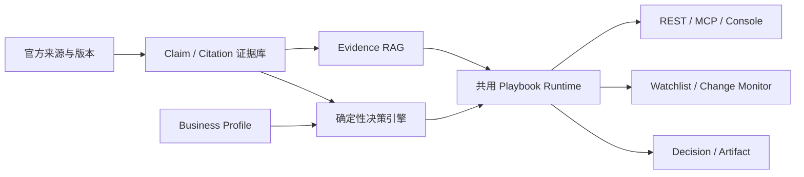

# Stablecoin Policy Domain API — Formal Development Spec

**Date:** 2026-07-31

**Revised:** 2026-08-01

**Status:** Phase 2 infrastructure deployed through migration `0019`; provisional-assurance baseline work pending

**Code baseline:** GitHub `main` after production cutover PR #34
**Scope:** Convert Stablecoin Policy from a public tracker plus paid-report service into the public Stablecoin Policy subsite and the authenticated domain backend for Citely playbooks.
**Execution plan:** `docs/superpowers/plans/2026-08-01-stablecoin-policy-master-development-plan.md`

**Bootstrap policy revision (2026-08-01):** Initial operation does not require a
human review team. Machine-validated evidence may be published and sold only
through an explicitly provisional assurance lane with exact citations,
limitations, and counsel triggers. Existing named-human review workflows remain
a separate higher-assurance path and are not weakened or relabeled.

## 1. Executive summary

Stablecoin Policy already has useful official-source discovery, provenance-aware deduplication, source-health checks, public tracker pages, report generation, OpenAPI, x402, and Alipay report delivery. Those capabilities are retained.

The next development cycle adds four missing product layers:

1. external production storage that satisfies GitHub Issue #14;
2. a provision-level legal corpus and stablecoin/issuer/deployment dossiers;
3. private deterministic playbook evaluation and evidence assembly;
4. an authenticated `PlaybookPackage + EvidenceBundle` API consumed by the thin Citely main site.

Citely remains the customer-facing paid surface. It owns authentication, subscription, entitlement, domain routing, and generic rendering. Stablecoin Policy owns all stablecoin-specific data, playbook schemas, private `DecisionRule` execution, `PlaybookAction` generation, evidence, package versions, and monitoring impact.

The first paid vertical slice is the **Stablecoin Pre-listing & Product Launch**
playbook. It begins as an evidence-backed, explicitly provisional workflow that
may be delivered without human review. A later human-reviewed tier upgrades
assurance but is not a bootstrap dependency. Broad self-service is released
only for jurisdiction, asset, and capability combinations that pass the
applicable evaluation gates in this spec.

## 2. Goals

- Keep the public jurisdiction tracker working throughout the migration.
- Preserve and extend the official-source adapters delivered in PR #13.
- Stop daily generated data from growing Git history.
- Make every material paid conclusion traceable to an exact official source version and provision.
- Model stablecoins, issuers, deployments, authorizations, reserves, redemption, and controls separately from jurisdiction summaries.
- Produce deterministic capability-level statuses with explicit unknown and review states.
- Return a presentation-safe, immutable package that Citely can render without stablecoin-specific code.
- Detect source changes and identify affected claims, rules, packages, and watchlists.
- Establish measurable quality gates for data, retrieval, decisions, actions, APIs, and monitoring.

## 3. Non-goals

- Building the Citely main-site UI, billing system, or identity provider.
- Implementing AI Policy or Web3 Policy inside this repository.
- Rebuilding KYC, KYT, sanctions screening, Travel Rule messaging, custody, reserve accounting, or market-data products.
- Claiming global asset-level coverage at launch.
- Returning a single asset-wide “compliant/non-compliant” label.
- Allowing an LLM to present an unreviewed output as definitive legal
  permission, compliance clearance, legal advice, or human-reviewed work.
- Rewriting existing Git history during the first storage migration.
- Providing legal advice or replacing qualified counsel.

## 4. Current implementation baseline

### 4.1 Retained capabilities

- public tracker, map, jurisdiction views, news, methodology, and bilingual UI;
- official feeds and structured adapters for Federal Register, Regulations.gov, GovInfo/Congress.gov, legislation.gov.uk, and first-party regulator feeds;
- `officialDocumentId`, `sourceVersion`, official URL/PDF, `retrievedAt`, and related-document metadata;
- provenance/version-aware deduplication;
- per-run source-health checkpoint and fail-closed paid-report publishing;
- official-only regional summaries and daily reports;
- x402, Alipay, report encryption, and OpenAPI patterns;
- model token/cost logging and dry-run smoke tests.

### 4.2 Known gaps

- official events are not yet a canonical `SourceDocument → SourceVersion → Provision` corpus;
- historical jurisdiction blurbs and legislation often lack provision-level citations and effective-date semantics;
- there is no asset/issuer/deployment dossier layer sufficient for Pre-listing;
- there are no production `DecisionRule`, `PlaybookAction`, `PlaybookPackage`, or `EvidenceBundle` implementations;
- the API currently focuses on report listing and purchase rather than structured policy and playbook packages;
- monitoring does not yet trace a source change through claims and decisions to affected customer packages;
- legacy AI, data-center, politician, donor, and broad policy code remains in the stablecoin repository;
- automated coverage protects the Phase 0 storage boundary and Phase 1 cache, immutable publication, checksum, historical replay, privacy allowlist, dual-read behavior, and controlled origin-outage behavior for public datasets and paid reports.

### 4.3 Phase 0 completion checkpoint — 2026-07-31

The first compatibility slice is complete locally:

- existing report reads now pass through provider-neutral `ReportMetadataRepository` and `ImmutableObjectStore` interfaces;
- the current Git-backed report index and encrypted files are retained behind file adapters, so x402, Alipay, report listing, and OpenAPI callers keep their existing entry points;
- immutable file-object writes enforce checksum validation, idempotent same-content retries, path containment, and conflict rejection;
- the initial PostgreSQL migration defines queryable report-release metadata and immutable object references with row-level security enabled;
- versioned JSON Schemas cover report metadata, list responses, and problem details;
- Node test, typecheck, and Phase 0 security-eval commands are present and passing;
- at this Phase 0 checkpoint, no production Supabase migration or data cutover had occurred.

### 4.4 Phase 1 completion — 2026-07-31

The Issue #14 external-storage phase is complete. Canonical-owner and duplicate-file inventory, Supabase PostgreSQL and Storage adapters, versioned backfill, cached server-side loaders, dual-read equality checks, workflow cutover, CI size limits, restore verification, production read cutover, and controlled outage behavior have passed their gates.

The deployed Phase 1 implementation includes the data inventory and no-growth baselines; Supabase REST/Storage adapters; immutable report and dataset publication functions; checksum-verified runtime modes for `file`, `dual`, and `supabase`; bounded stale-cache behavior; a public dataset API; report and dataset backfill plus dry-run restore commands; workflow feature flags; CI data-size/diff limits; and Phase 1 unit/eval cases. Runtime news is no longer duplicated into `public/news-summaries.json` or baked into the generated entity bundle. The linked Supabase project has both migrations applied, the `policy` schema exposed to PostgREST, and both required buckets provisioned as private. Strict live dual-read passed for all four reports and all three active datasets. The `daily-report` rollback drill activated the prior release and restored the latest release successfully. A Storage-only ingestion published new releases without changing `main`; `POLICY_STORAGE_PUBLISH_ENABLED` and `POLICY_STORAGE_CUTOVER` are enabled; Vercel production reads from Supabase. Controlled fault injection verified checksum-validated stale dataset and paid-report delivery inside the allowed window, plus fail-closed behavior on cold start and after maximum stale expiry.

## 5. Target architecture



Source adapters ingest official material into immutable Supabase Storage objects and normalize `SourceDocument`, `SourceVersion`, and `Provision` records in PostgreSQL before reviewed claims and citations enter the evidence library.

Public pages and public APIs use assurance-filtered, allowlisted views of the
same source-backed data. Every non-raw output exposes its assurance and review
state. They never expose raw rules, private decision graphs, customer facts,
paid packages, or private reviewer records.

### 5.1 Evidence RAG boundary

Evidence RAG is an evidence retrieval and explanation layer, not a decision authority:

- an immutable `RetrievalCorpusSnapshot` may aggregate multiple same-tier,
  same-jurisdiction source releases; the database computes and pins exact source
  manifests plus deduplicated claim membership;
- embeddings are generated once into a private checksum-pinned build artifact
  outside the repository, and the DRAFT build replays that exact artifact;
- activation requires a passing eval bound to the exact current index manifest;
  provisional indexes accept machine-assured or human-reviewed evals, while
  human-reviewed indexes accept only named human-reviewed evals;

- it searches only versioned provisions and claims permitted for the caller's
  requested assurance tier; provisional and human-reviewed evidence remain
  distinguishable;
- it retrieves, ranks, groups, and explains evidence for the shared Playbook Runtime;
- the deterministic engine alone assigns capability statuses and reason codes;
- RAG cannot create or approve a `LegalClaim`, change a `DecisionRule`, or override a `DecisionResult`;
- every returned excerpt includes its source document, source version, provision locator, canonical URL, review state, and retrieval score;
- every package pins the corpus release and retrieval-index release used during retrieval;
- missing, conflicting, stale, or low-confidence retrieval returns an explicit insufficient-evidence state rather than a generated legal conclusion;
- if RAG is unavailable, deterministic evaluation can still run, while evidence explanation is marked degraded and no unsupported narrative is generated.

## 6. Storage architecture

### 6.1 Provider decision

Object Storage is a storage category, not another name for Supabase. For the initial implementation this spec selects:

- **Supabase PostgreSQL** for queryable records and relationships;
- **Supabase Storage** for raw documents and immutable artifacts.

The choice minimizes initial operational work by using one managed platform. Application code must use repository-owned database and object-storage interfaces so a later move to Neon, Cloudflare R2, S3, or another compatible provider does not change domain models or API contracts.

### 6.2 Storage allocation

| Data | Storage | Notes |
|---|---|---|
| application code and migrations | Git | reviewed and versioned |
| JSON Schema and OpenAPI | Git | shared contract source |
| source registries and adapter configuration | Git | no secrets |
| playbook templates and private `DecisionRule` definitions | Git | server-only, reviewed, tested |
| small sanitized fixtures and release manifests | Git | size-limited |
| source authority/document/version metadata | PostgreSQL | queryable history |
| provisions, claims, citations, events, reviews | PostgreSQL | relational evidence graph |
| RAG chunks, embeddings, index releases, retrieval audit | PostgreSQL with `pgvector` | queryable and version-linked to reviewed provisions |
| stablecoins, issuers, deployments, authorizations | PostgreSQL | canonical dossiers |
| playbook releases, runs, normalized inputs, results, actions | PostgreSQL | customer access controlled |
| evidence references, artifact references, watchlists | PostgreSQL | object keys and relations |
| report metadata, price, status, versions | PostgreSQL | replaces `data/reports/index.json` |
| raw HTML, XML, JSON, PDF, and normalized text | Supabase Storage | immutable source objects; commercial internal-storage rights required before upload |
| report Markdown, JSON, and PDF | Supabase Storage | private or explicitly public |
| complete `PlaybookPackage` JSON snapshots | Supabase Storage | immutable reproducibility artifact |
| Evidence Packs and exports | Supabase Storage | private signed delivery |
| mirrored licensed research artifacts | Supabase Storage | rights metadata required |

### 6.3 Report storage

Report bodies are not stored as PostgreSQL text by default. PostgreSQL stores metadata, versions, entitlement/price information, source relationships, object key, checksum, size, and publication state. The complete Markdown, JSON, or PDF artifact is stored in Supabase Storage.

The current encrypted `data/reports/*.md.enc` flow remains readable during migration. Initial backfill uploads the encrypted artifacts unchanged and records their current AES-256-GCM metadata. New private buckets and signed URLs do not by themselves require removal of application-level encryption; changing encryption is a separate reviewed migration.

### 6.4 Playbook storage

Playbook templates and raw `DecisionRule` definitions live in Git so they can be reviewed, tested, released, and rolled back. PostgreSQL stores release metadata, run state, normalized customer inputs, results, actions, reviews, and relationships. Supabase Storage stores the complete immutable package and exported evidence artifacts.

```text
Git                  PostgreSQL                 Supabase Storage
template             playbook_release           package JSON
DecisionRule    →     playbook_run         →     Evidence Pack PDF
tests                decision_result             report/export files
                     PlaybookAction
                     artifact_ref
```

### 6.5 Citely storage boundary

Citely should store only the minimum shared commercial data it owns, such as account, subscription, entitlement, domain, opaque `package_id`, and delivery state. It must not duplicate the stablecoin legal corpus, rules, evidence graph, or complete customer input snapshot.

### 6.6 Retention and integrity

- All immutable objects have a SHA-256 checksum and content type.
- Object keys are versioned and never overwritten in place.
- Corrections create a new object and mark the old record `corrected` or `superseded`.
- Customer input retention is configurable and minimized by default.
- Deletion requests remove or cryptographically make inaccessible customer-identifying data while preserving non-identifying regulatory audit records where legally appropriate.
- Private artifacts use server-side access controls and short-lived signed URLs.

## 7. Canonical data model

### 7.1 Legal evidence

| Entity | Purpose | Required identity/version behavior |
|---|---|---|
| `SourceAuthority` | issuing institution | stable authority ID and official domain |
| `SourceDocument` | logical official document | authority, official ID, type, canonical URL |
| `SourceVersion` | immutable observed version | checksum, object key, retrieval and legal dates |
| `Provision` | addressable passage | source version, locator, language, text/object reference |
| `LegalClaim` | normalized reviewed proposition | jurisdiction, topic, status, effective interval, review state |
| `Citation` | claim-to-provision edge | support type, exact locator, allowed excerpt |
| `RegulatoryEvent` | change/deadline | before/after versions, observed/effective time, affected claims |
| `ReviewRecord` | human approval/audit | reviewer role, outcome, time, evidence version |
| `MachineAssuranceRecord` | reproducible automated validation | validator/model versions, fingerprints, confidence, blockers, outcome |
| `EvidenceChunk` | provision-aligned retrieval unit | immutable text/reference, provision ID, source version, rights and review state |
| `EmbeddingRecord` | vector representation of a chunk | embedding model/version, dimensions, checksum, created time |
| `RetrievalIndexRelease` | reproducible searchable corpus | corpus manifest, filters, FTS/vector configuration, release state |
| `RagRetrievalRun` | retrieval audit trail | query hash, filters, index release, ranked chunk IDs and scores |

Required time fields are `published_at`, `effective_from`, `effective_to`, `observed_at`, `retrieved_at`, `verified_at`, `corrected_at`, `as_of`, and `knowledge_cutoff` where applicable.

### 7.2 Stablecoin and issuer evidence

- `Stablecoin`
- `Issuer`
- `IssuerAuthorization`
- `Deployment`
- `BridgeRelationship`
- `ReserveDisclosure`
- `RedemptionPolicy`
- `AdministrativeControl`
- `OperationalIncident`
- `AttestationOrAssuranceReport`

Native, bridged, wrapped, and synthetic representations must be distinguishable. Contract addresses require issuer, chain, explorer, or other authoritative verification. Issuer marketing pages alone cannot establish a legal authorization.

### 7.3 Decision and playbook records

- `BusinessProfile`
- `PolicyCheckRequest`
- `DecisionRuleRelease`
- `DecisionResult`
- `ReasonCode`
- `PlaybookTemplateRelease`
- `PlaybookRun`
- `PlaybookAction`
- `EvidenceBundle`
- `PlaybookPackage`
- `ArtifactReference`
- `Watchlist`
- `ChangeImpact`

Old runs, decisions, evidence, packages, and releases are never silently mutated.

## 8. Source ingestion and legal corpus

### 8.1 Pipeline

```text
source registry
→ adapter fetch
→ raw object upload and checksum
→ document identity resolution
→ source-version comparison
→ provision extraction
→ candidate claim/event generation
→ deterministic validation
→ machine cross-check and provisional assurance
→ optional human review and assurance upgrade
→ assurance-scoped corpus release
→ provision-aligned chunking and hybrid RAG indexing
→ public view and private rule availability
→ change cursor
```

LLMs may classify, summarize, translate, propose claims, and produce a
reproducible cross-check record. They cannot label their own work as
`HUMAN_REVIEWED`, change a deterministic decision status, or substitute a
generated summary for official text.

Only evidence admitted by an explicit assurance policy enters a production
retrieval index. Provisional and human-reviewed corpus/index releases remain
identifiable and filterable. A correction or new `SourceVersion` creates a new
corpus and index release; it never silently changes historical retrieval
results. Chunking follows legal structure such as article, section, paragraph,
schedule, or official page locator before applying bounded text windows. It
must not merge provisions from different versions or authorities into one
chunk.

### 8.2 Initial coverage priority

Unless changed by a design-partner decision, the initial Pre-listing corpus targets:

- EEA;
- Hong Kong;
- Singapore;
- USDC;
- USDT.

The next adapter priorities are EUR-Lex/CELLAR, Hong Kong e-Legislation/LegCo, Singapore Statutes Online/MAS source sets, and the official issuer/deployment/reserve/redemption records for the initial assets.

### 8.3 Source health behavior

- Health is tracked per adapter and required source family.
- Public pages may display a cached snapshot with `data_as_of` and a stale warning.
- Paid evaluation returns `UNDETERMINED`, `UNSUPPORTED_SCOPE`, or `REVIEW_REQUIRED` when required evidence is stale, missing, or conflicting.
- `PERMITTED` requires direct authoritative support.
- News and research remain discovery/context and cannot independently support `PERMITTED`.

### 8.4 Assurance levels and bootstrap publication

The machine-assurance ladder (accepted 2026-08-01) is a strictly ordered
sequence of machine states:

- `SOURCE_OBSERVED`: immutable official material acquired;
- `SOURCE_VALIDATED`: source identity, version, checksum, locator, rights, and
  freshness checks passed;
- `AI_EXTRACTED`: a machine-generated structured claim has exact citations;
- `AI_CROSS_CHECKED`: an independent model pass plus deterministic validation
  found no unresolved contradiction or scope blocker;
- `PROVISIONAL_PUBLISHED`: the terminal machine state — `AI_CROSS_CHECKED`
  evidence published through an explicit atomic path with every deterministic
  check passing and zero blockers.

`HUMAN_REVIEWED` is deliberately **not** a machine state. It is a separate
upgrade path that can be applied on top of any machine state, is the only
action that may set a human-review flag, and always requires a named human
reviewer. No machine transition, record, or publication may set, imply, or
satisfy it; existing `VERIFIED`, review, and published-release states retain
their named-human meaning. A machine assurance record cannot satisfy a
human-only invariant, mutate a human review record, or advance reviewed
coverage.

The executable model is `specs/machineAssurance.qnt` (gated in
`npm run spec:phase2`). Its invariants are normative: machine states can never
impersonate human review; `PROVISIONAL_PUBLISHED` requires every deterministic
check (identity/checksum, storage rights, citation locator, freshness,
no-contradiction, independent cross-check agreement) plus a written assurance
record; and evidence with any failed check is unreachable for publication.
Database implementation must map these states through forward-only schema
changes that preserve the model's transition guards.

Bootstrap publication is permitted for `AI_CROSS_CHECKED` evidence only
through the `PROVISIONAL_PUBLISHED` path, and every published response must be
labeled provisional and include assurance level, review status, confidence,
blockers, source versions, `as_of`, knowledge cutoff, citations, limitations,
and counsel triggers. Missing, stale, conflicting, or rights-blocked material
produces a typed blocking or undetermined state — it can never yield a
deterministic conclusion.

Phase 2 exit conditions (revised 2026-08-01):

1. EEA and Singapore publish reproducible provisional baselines with explicit
   completeness and limitations;
2. every claim traces to a specific provision locator and pinned source
   version;
3. machine data is never labeled `HUMAN_REVIEWED`, enforced in the Quint
   model, the database write path, and the public views;
4. missing, conflicting, stale, or rights-restricted evidence automatically
   blocks deterministic conclusions;
5. Hong Kong truthfully reports its incomplete, blocked state.

## 9. Decision engine and first playbook

### 9.1 First vertical slice

The first paid workflow is **Stablecoin Pre-listing & Product Launch** for small exchanges, wallets, and payment integrators.

Inputs include:

- operator entity and operating jurisdiction;
- licences or registrations;
- customer locations and customer type;
- activities and product capabilities;
- stablecoin, issuer, network, contract, and deployment type;
- custody, transfer, swap, redemption, rewards, and settlement behavior;
- requested `as_of` date.

### 9.2 Statuses

- `PERMITTED`
- `CONDITIONAL`
- `RESTRICTED`
- `PROHIBITED`
- `UNDETERMINED`
- `UNSUPPORTED_SCOPE`
- `REVIEW_REQUIRED`

The system returns a capability matrix rather than one asset-wide status.

### 9.3 Rule behavior

- Rules are deterministic and versioned in Git.
- A rule references normalized claims and reason codes, not free-form model output.
- Missing material facts block the affected branch.
- Conflicting evidence forces review.
- Same normalized input plus pinned versions returns the same status and reason codes.
- LLM synthesis may explain a result but cannot override it.

### 9.4 Playbook actions

Each material action includes an ID, label, description, priority, owner type, deadline logic if applicable, review requirement, evidence IDs, and affected capability. No action may be generated without traceable evidence or an explicit non-legal operational basis.

## 10. API contract

### 10.1 Public endpoints

- `GET /v1/coverage`
- `GET /v1/catalog/jurisdictions`
- `GET /v1/catalog/stablecoins`
- `GET /v1/jurisdictions/{id}`
- `GET /v1/stablecoins/{id}`
- `GET /v1/deployments/{id}`
- `GET /v1/sources/{id}`
- `GET /v1/changes?after_cursor=`
- `GET /v1/policy-feed`

Public endpoints contain public intelligence and citations. They never return raw rules, customer data, paid packages, or private reviewer information.

`GET /v1/policy-feed` is a thin projection of the active, checksum-verified
`news-summaries` release. Its v1 response requires top-level `schemaVersion`,
the immutable release `generatedAt`, and flat `items`. Every item requires
`date`, `jurisdiction`, one compact `summary`, and HTTPS `sourceUrl`, with an
optional subsite-owned `playbookId`. Request time must never replace
`generatedAt`. Citely rejects an unsupported schema or any invalid item as a
whole and may fall back to its last known-good snapshot while retaining the
snapshot time. The implementation plan is
`docs/superpowers/plans/2026-08-01-citely-policy-feed.md`.

### 10.2 Authenticated Citely endpoints

- `GET /v1/playbooks`
- `GET /v1/playbooks/{id}`
- `POST /v1/evidence/search`
- `POST /v1/playbook-packages`
- `GET /v1/playbook-packages/{id}`

`POST /v1/playbook-packages` is the composed Citely operation. It validates entitlement and customer-confirmed facts, pins versions, evaluates rules, generates actions, assembles evidence, stores the immutable package, and returns presentation-safe data or an opaque package reference.

`POST /v1/evidence/search` accepts a natural-language query plus structured filters including jurisdiction, topic, `as_of`, source type, review state, corpus release, and retrieval-index release. It returns ranked excerpts and complete citations, not raw rules or an ungrounded answer. The Playbook Runtime may use this service to assemble evidence and explanations, but the service cannot assign or change a decision status.

### 10.3 Package requirements

Every package includes:

- `package_id`, domain, playbook ID, title, stage, and display schema;
- evaluated capability results, reason codes, and generated actions;
- EvidenceBundle containing claims, provisions, precise locators, official URLs, and review state;
- corpus, rule-set, playbook-template, source-snapshot, and response-schema versions;
- `as_of`, `knowledge_cutoff`, and `evaluated_at`;
- coverage, freshness, uncertainty, blocking, and human-review state;
- assurance level, provisional status, confidence, limitations, and counsel
  triggers;
- immutable artifact reference and integrity metadata.

It excludes raw rules, private decision graphs, secrets, unrelated customer facts, hidden prompts, and model chain-of-thought.

### 10.4 Authentication and reliability

- Citely calls paid endpoints server to server.
- The first implementation uses a signed, short-lived entitlement assertion plus service authentication; exact key-management mechanics are finalized before endpoint coding.
- Package creation requires an idempotency key.
- Paid retries never create duplicate charges or runs.
- Requests and responses validate against versioned JSON Schema.
- Schema mismatch is rejected as a whole; Citely does not partially render an unknown version.

## 11. Reports and existing paid endpoints

Existing x402 and Alipay report endpoints remain compatible during the migration. They are not the Citely playbook contract.

The report loader is changed behind the existing route:

```text
existing route
→ report metadata from PostgreSQL
→ encrypted/private artifact from Supabase Storage
→ existing payment and decryption behavior
```

Public report catalog metadata remains cacheable. Paid content and signed artifact URLs are never publicly cached. Report generation writes storage/database records and does not commit artifacts to Git.

## 12. Change-to-Action monitoring

Required event chain:

```text
SourceVersion change
→ RegulatoryEvent
→ affected LegalClaim
→ affected DecisionRule release
→ affected DecisionResult and PlaybookPackage
→ ChangeImpact
→ review/re-evaluation state exposed to Citely
```

Stablecoin Policy owns the impact mapping. Citely does not maintain `policy-playbook-map.json` or stablecoin-specific invalidation logic.

Events are cursor-based and at least once. Every event has immutable `event_id`, cursor, source versions, and affected entity IDs. Consumers can deduplicate and replay.

## 13. Evaluation and quality system

### 13.1 Eval datasets

Create versioned, sanitized datasets under `evals/`:

- `source-discovery.jsonl`
- `source-versioning.jsonl`
- `provision-extraction.jsonl`
- `legal-claims.jsonl`
- `retrieval.jsonl`
- `prelisting-cases.jsonl`
- `playbook-actions.jsonl`
- `monitoring-events.jsonl`
- `security-cases.jsonl`

Small reviewed gold fixtures live in Git. Production-scale eval corpora live in object storage with a pinned manifest. Split datasets into development, regression, and hidden holdout sets. Production errors and human corrections become new regression cases.

### 13.2 Quality metrics and release thresholds

| Layer | Metric | Gate |
|---|---|---:|
| source discovery | gold document recall | ≥95% |
| source purity | paid evidence from allowed sources | 100% |
| required metadata | ID, URL, version, checksum, dates | 100% |
| ingestion idempotency | duplicate same-version records | 0 |
| provision extraction | correct version and locator | 100% for paid evidence |
| citation traceability | material claims linked to provisions | 100% |
| claim grounding | evidence directly supports claim | ≥98%; critical claims 100% |
| contradiction | material claim conflicts with authority | 0 |
| retrieval | gold provision Recall@10 | ≥95% |
| retrieval ranking | gold provision MRR@10 | ≥0.90 |
| structured filtering | jurisdiction/topic/date/review filters correct | 100% |
| index version isolation | retrieval contains only the pinned release | 100% |
| citation precision | cited evidence supports output | 100% |
| RAG faithfulness | explanatory statements entailed by cited evidence | ≥98%; critical statements 100% |
| RAG safety | stale, unreviewed, unauthorized, or prompt-injected instructions used as authority | 0 |
| critical rule cases | expected status exact match | 100% |
| determinism | repeated pinned run equality | 100% |
| RAG independence | RAG outage or disablement changes deterministic status/reason codes | 0 |
| safe degradation | missing/stale/conflicting input blocks certainty | 100% |
| action grounding | material actions have evidence IDs | 100% |
| API contract | schema and consumer fixtures pass | 100% |
| privacy | raw rule/customer-data leakage | 0 |
| replay | historical package reproducibility | 100% |
| monitoring | known affected-package recall | ≥95% |
| monitoring severity | known critical change missed | 0 |

### 13.3 Assurance and human review

- Human review is an assurance upgrade, not an initial publication dependency.
- Machine validation records identify the models, templates, parameters, input
  and output fingerprints, evidence versions, confidence, blockers, and time.
- Machine outputs can never approve or impersonate `HUMAN_REVIEWED` evidence.
- A machine-assured retrieval gold set requires separate generator and checker
  identities. The checker pins the exact proposal and corpus snapshot manifest;
  only case-level agreement on expected provisions is accepted, and any lost
  required checklist-topic coverage blocks the whole assembled dataset.
- When human review is used, records identify reviewer role, evidence version,
  outcome, time, and severity.
- Critical human-reviewed golden cases may receive dual-review sampling with
  adjudication of disagreements after a reviewer program exists.
- LLM-as-judge may assist style, triage, and reproducible cross-checking but
  cannot establish human legal approval.
- Self-service readiness is measured per supported scope using deterministic,
  grounding, retrieval, monitoring, privacy, and assurance-label gates; it does
  not depend on an arbitrary count of human-reviewed cases during bootstrap.

### 13.4 Eval execution

- **PR CI:** deterministic unit, schema, contract, golden-rule, privacy, and replay tests without live network dependency.
- **Nightly:** live adapter health, source discovery, retrieval, monitoring replay, and drift metrics.
- **Release:** full regression plus holdout eval, versioned eval report, and the
  approvals required by the advertised assurance tier. Provisional releases do
  not claim human sign-off.

### 13.5 Blocking failures

A paid release is blocked when:

- a material claim lacks provision-level evidence;
- a citation contradicts the claim;
- any critical rule case returns the wrong status;
- missing material facts still produce a definitive permission;
- a required source is stale or failed without a blocking state;
- retrieval crosses the pinned corpus/index boundary or cites evidence not
  authorized for the advertised assurance tier;
- a material RAG explanation is unsupported by its cited provisions;
- disabling RAG changes a deterministic status or reason code;
- a package cannot be reproduced from pinned versions;
- a public or Citely response leaks raw rules or unnecessary customer facts;
- a known critical monitoring event is missed;
- the eval report omits corpus, rules, template, source snapshot, or eval dataset versions.

## 14. Security, privacy, and rights

- Public and paid API credentials are separated.
- Database access is server-only and least privilege.
- Customer facts are encrypted in transit and at rest, access logged, and retained only as needed.
- Service logs never contain complete customer fact payloads, decrypted reports, private package bodies, or secrets.
- Object buckets default private; public artifacts are explicitly designated.
- Signed download URLs are short lived and scoped to one artifact.
- Research, issuer documents, and legal sources separately record commercial
  internal-storage rights and public redistribution/excerpt rights. Public
  availability or permission to download one personal copy does not authorize
  ingestion into Citely's commercial object storage.
- `REVIEW_REQUIRED` and `PROHIBITED` storage-rights states fail closed before
  an upload request. `ALLOWED` requires a dated per-artifact rights review and
  a recorded licence, permission, or other reviewed basis.
- Extraction-time provision rows remain immutable. A later rights review may
  promote an originally `UNKNOWN` excerpt permission only through an immutable,
  dated overlay; it cannot rewrite source text, locators, versions, or the
  original permission. Effective permissions are resolved at read time, and a
  rights promotion never implies source verification or public publication.
- Prompt-injection content in retrieved documents is treated as untrusted data.
- Raw `DecisionRule` definitions and internal prompts remain server-side.

## 15. Repository and migration plan

### Phase 0 — contracts, adapters, and tests

- add database and object-storage interfaces;
- add migrations and local/test configuration;
- add shared JSON Schema and OpenAPI foundations;
- add unit-test runner, deterministic fixtures, and initial eval harness;
- keep current file loaders as compatibility adapters.

Exit: existing site and report APIs pass tests through the compatibility layer.

### Phase 1 — Issue #14 external storage

- inventory canonical owners and duplicated files;
- upload current datasets and report artifacts;
- backfill metadata, object references, versions, and checksums;
- introduce cached server-side loaders with explicit stale behavior;
- dual-read and compare file versus external results;
- switch production reads after equality checks;
- change daily workflow to upload/update rather than commit;
- stop tracking migrated generated files without rewriting history;
- add CI file-size and data-diff limits.

Exit: daily ingestion creates no large Git commit, current routes survive temporary storage failure according to documented cache policy, and a previous dataset can be restored.

Exit achieved: the Storage-only workflow completed without changing `main`, production reads use Supabase, rollback and reactivation succeeded, and the controlled outage rehearsal passed for warm, cold, and expired-cache states.

### Phase 2 — canonical legal corpus

- normalize existing official-source output;
- store immutable raw versions and provisions;
- create claims, citations, events, and review queues;
- expose public coverage, source, and change APIs;
- migrate launch-market baseline claims.

Exit: each launch baseline claim has provision-level evidence, an explicit
assurance level, and reproducible `as_of` state. EEA and Singapore may launch as
provisional baselines; reviewed completeness remains separate. Hong Kong must
retain an explicit incomplete/blocking state until its core authority is
resolved.

Implementation checkpoint (2026-07-31): migration `0003` defines a shared
`regulatory` schema for authorities, documents, immutable versions, provisions,
and events, while the `policy` schema owns Stablecoin-specific claims,
citations, review records, corpus releases, and coverage scopes. Public views
exclude reviewer identity and private notes and admit only reviewed evidence in
a published, `as_of`-pinned corpus. Versioned contracts and server-side public
routes now cover `/v1/coverage`, `/v1/sources/{id}`, and `/v1/changes`.

Source-ingestion checkpoint (2026-08-01): migrations `0004` and `0005` add
service-only source ingestion and health checks. MiCA is stored as one
`OBSERVED` CELLAR version with 149 article provisions. The next Hong Kong
adapter consumes Department of Justice HKeL archives with ZIP integrity,
archive-entry provenance, embedded-document identity, and structured section
locators. Cap. 656 is blocked because its current official XML entry embeds
Cap. 155 identifiers; Cap. 656A is independently parseable but remains
reference-only and cannot make Hong Kong baseline coverage complete. Migration
`0006` is applied and Cap. 656A is stored as one `OBSERVED` version with four
provisions; no Hong Kong claim or coverage completion is published.
Publication gates block unreviewed claims, missing provision citations,
contradictions, and permissions without direct official support. Migration
`0003` is applied to the linked Supabase project and its private source bucket
and reviewed-only views pass production smoke checks. No launch-market claim is
treated as reviewed merely because a legacy summary or news item exists.

Source-rights checkpoint (2026-08-01): migration `0007` and the publisher add
a two-layer commercial storage-rights gate that is independent of public
redistribution and excerpt permissions. Registry entries default to a blocking
state unless a dated review and rights basis support `ALLOWED`; the database RPC
repeats the same check. MAS's 2023 stablecoin consultation response remains
outside Storage because the current MAS Terms of Use do not grant commercial
copying permission without prior written permission.

Rights-reconciliation checkpoint (2026-08-01): migration `0008` demonstrated
that the existing provision immutability trigger correctly rejects an attempted
in-place permission promotion and rolls back the entire RPC. Migration `0009`
therefore adds a service-only, immutable provision-rights review overlay and v5
ingestion RPC. EUR-Lex MiCA now resolves to 149 effective `ALLOWED` provisions
under Commission Decision 2011/833/EU and the EUR-Lex Legal Notice; HKeL Cap.
656A remains four effective `LINK_ONLY` provisions under DATA.GOV.HK Terms v1.2.
Both stay `OBSERVED` and unverified, and the replay creates no claim, coverage,
release, decision rule, or playbook action.

Source-verification workflow checkpoint (2026-08-01): migration `0010` adds an
immutable private `SourceVerificationRecord`, a deterministic manifest over the
source object/version and provision locator/checksum/rights metadata, and an
atomic service-only human-review RPC. Approval requires an exact freshly
computed manifest fingerprint, an identified non-automated reviewer, reviewed
commercial storage rights, at least one provision, no unknown effective excerpt
permissions, and an `OBSERVED` source. The approval record and transition to
`VERIFIED` commit together; rejection leaves the source `OBSERVED`. The workflow
does not create claims or make evidence public, and deployment alone never
verifies a production source. Migration `0010` is applied to production;
read-only manifests and the stale-fingerprint rollback smoke confirm all four
current source versions remain `OBSERVED` and unverified.

Claim-review workflow checkpoint (2026-08-01): migration `0011` adds a
deterministic manifest over claim content and complete citation/source metadata,
freezes claims and citations after submission, and records named-human outcomes
through one atomic service-only RPC. Approval requires an exact current manifest,
an approved source-verification record, a `VERIFIED` official source, direct
support, known excerpt rights, and no contradictory or unauthorized evidence.
The corpus publication trigger independently rechecks the current approved
fingerprint and applies the verified-evidence rule to every legal status. The
workflow creates no baseline claims and grants no automated approval authority.
Migration `0011` is applied to production; permission-denial and missing-claim
smokes pass, and claim, citation, review, corpus, and impact tables remain empty.

Corpus-release workflow checkpoint (2026-08-01): migration `0012` adds
`IN_REVIEW`, immutable named-human release-review records, deterministic release
manifests that embed every claim-review manifest, and controlled create, submit,
review, and publish RPCs. Approval fails closed on empty/unreviewed/stale claim
membership and `as_of` or knowledge-cutoff violations. Publication recomputes
the approved manifest and reruns claim evidence gates. The service role cannot
mutate release rows directly, deployment creates no release, and coverage
advancement remains a separate reviewed step.
Migration `0012` is applied to production; direct-insert denial, invalid-create,
database-lint, public-boundary, and zero-row metadata checks pass.

Coverage-review workflow checkpoint (2026-08-01): migration `0013` requires an
immutable versioned jurisdiction checklist, explicit supporting reviewed claim
IDs, a selected published corpus release, a freshness cutoff satisfied by every
cited source version, and an exact deterministic manifest approved by a named
human. The service role loses direct coverage update authority; its only
advancement path is the atomic review RPC. Deployment and corpus publication do
not create a checklist or advance coverage. Until the EEA, Hong Kong, and
Singapore baseline definitions are independently agreed and populated with
reviewed evidence, all three scopes remain `IN_PROGRESS`, `0%`, and `UNKNOWN`.
Migration `0013` is applied to production; direct-update denial, invalid-ID,
database-lint, public-boundary, and zero-row metadata checks pass.
Migration `0014` closes the inherited direct `INSERT` grant; production smoke
now proves the service role cannot directly insert, update, or delete coverage
rows, and the post-migration snapshot confirms no business-data change.

Executable-specification checkpoint (2026-08-01): the Phase 2 publication
lifecycle now has a pinned Quint 0.32.0 model covering source verification,
claim review, corpus review/publication, coverage review, atomic rejection, and
the service-role coverage boundary. Twelve deterministic scenarios exercise the
happy path, automated-review rejection, stale fingerprints at every review
layer, missing publication, and denied direct coverage mutation. Five safety
invariants and four reachability witnesses run in CI together with the Phase 2
eval suite. The model contains sanitized state only and does not define legal
claims, private decision rules, or playbook actions. It is sampled executable
specification, not an exhaustive proof or a replacement for human legal review.

Database-integration checkpoint (2026-08-01): an isolated Supabase PostgreSQL
job now applies migrations `0001` through `0019` from zero and runs 120 pgTAP
assertions against the real Phase 2 RPCs, triggers, grants, manifests, and public
views. A sanitized transaction reaches the complete reviewed-publication path;
stale fingerprints and automated reviewers are rejected without partial audit
writes; direct service-role coverage and review-table writes remain denied. The
test rolls back all fixtures and does not approve production evidence.

Draft-import checkpoint (2026-08-01): migration `0015` and a default-dry-run
CLI atomically import human-prepared baseline claim/citation bundles as private
`DRAFT` rows. Immutable batch fingerprints make identical replay idempotent and
reject changed reuse; review/publication fields, partial batches, automatic
submission, approval, release, and coverage changes are forbidden. Sanitized
pgTAP cases cover success, replay, conflict, privacy, and rollback.

Baseline-readiness checkpoint (2026-08-01): migration `0016` adds a private,
service-only, read-only jurisdiction workflow report over source verification,
claim review, corpus publication, checklist, and coverage state. It returns
deterministic stages and blocker codes without claim content or reviewer data,
performs no state transition, and always states that legal completeness was not
assessed. Nine sanitized pgTAP assertions and seven eval cases cover empty and
partially progressed workflows, permission boundaries, ordering, and zero
automatic approval authority.

Claim-draft preflight checkpoint (2026-08-01): migration `0017` adds a
service-only `STABLE` preflight over an unimported claim/citation bundle. It
separates database import blockers from later evidence-review blockers, returns
no proposition or reviewer data, performs no writes, and always states that
legal validity was not assessed. The CLI runs it before explicit import and
still permits private DRAFT storage when only review evidence remains
incomplete. Sixteen pgTAP assertions and seven deterministic eval cases cover
permissions, missing references, ID conflicts, excerpt rights, evidence gates,
idempotent replay, manifest conflicts, and zero side effects.

Human-review queue checkpoint (2026-08-01): migration `0018` fulfills the
Phase 2 review-queue requirement with a service-only, read-only projection over
canonical source, claim, release, and coverage state. It returns prioritized
blockers, required inputs, next actions, and structured operator commands while
excluding propositions and reviewer-private data. It creates no task or audit
rows, cannot transition or approve a subject, and permanently reports that
human review is required and automatic approval is forbidden. Seventeen pgTAP
assertions and eight deterministic eval cases cover permissions, ordering,
limits, blockers, privacy, zero writes, and next-action routing.

Regulatory-change checkpoint (2026-08-01): migration `0019` completes the
event/impact write pipeline behind the existing `/v1/changes` read API. A
deterministic provision-level before/after manifest identifies added, modified,
and removed locators and suggests only `MAY_AFFECT / PENDING` impacts for
reviewed claims citing the before version. Named-human event approval and
named-human disposition of every impact are independently audited; publication
requires the current manifest, no pending impacts, and at least one reviewed
impact. Direct service-role writes are removed, and no RPC can alter claim,
citation, release, or coverage state. A companion Quint model adds eight
scenarios, four invariants, and two witnesses; 32 pgTAP assertions and eleven
eval cases cover diffing, fingerprints, permissions, privacy, audit
immutability, safe publication, and domain-state isolation. Backup format
`1.4.0` captures the new private audit metadata without exposing it publicly.

Production cutover checkpoint (2026-08-01): linked migration history now
matches `0001` through `0019`. A private `1.4.0` pre-cutover metadata backup and
post-cutover snapshot preserve all four source statuses and identical business
data: zero claims, releases, events, and impacts, with EEA, Hong Kong, and
Singapore still `IN_PROGRESS`, `0%`, and `UNKNOWN`. Linked database lint,
reviewed-only public-boundary smoke, read-only bundle preflight, jurisdiction
readiness, review queue, and the Vercel production coverage/change routes pass.
The separately configured canonical hostname still returns `404` for `/v1/*`
and requires domain mapping review; this does not affect the successful
database migration or justify rollback.

Bootstrap-assurance decision checkpoint (2026-08-01): the existing human-only
publication workflow remains deployed and unchanged, but it is no longer the
planned sole bootstrap path. The next Phase 2 work adds a separate, formally
modeled provisional lane for `SOURCE_VALIDATED`, `AI_EXTRACTED`,
`AI_CROSS_CHECKED`, and `PROVISIONAL_PUBLISHED` evidence. The machine-lane
state machine is modeled in `specs/machineAssurance.qnt` (section 8.4); its
invariants must be approved before any provisional database transition is
implemented. Reviewer Registry remains deferred under GitHub Issue #35.

### Phase 3 — Evidence RAG

- implement `EvidenceChunk`, `EmbeddingRecord`, `RetrievalIndexRelease`, and `RagRetrievalRun` storage;
- enable PostgreSQL full-text search and Supabase PostgreSQL `pgvector` through provider-neutral retrieval interfaces;
- create provision-aligned chunking that preserves source, locator, version, jurisdiction, topic, effective interval, rights, assurance, and review metadata;
- build immutable, versioned corpus manifests and retrieval-index releases;
- implement hybrid lexical/vector retrieval, structured filters, reranking, deduplication, and citation assembly;
- add `POST /v1/evidence/search` and internal retrieval contracts for the Playbook Runtime;
- allow explanation synthesis only from returned evidence authorized for the
  requested assurance tier and require sentence-level citation references for
  material statements;
- implement low-confidence, stale-index, conflicting-evidence, unauthorized-evidence, and retrieval-outage behavior;
- add retrieval, version-isolation, faithfulness, prompt-injection, rights, and safe-degradation evals.

Exit: gold provision Recall@10 is at least 95%, MRR@10 is at least 0.90, citation precision and version isolation are 100%, explanations pass faithfulness gates, and turning RAG off does not change deterministic statuses or reason codes.

### Phase 4 — asset and issuer dossiers

- implement stablecoin, issuer, authorization, deployment, reserve, redemption, control, and incident models;
- verify initial asset deployments and official documentation;
- expose catalog and dossier APIs;
- add dossier evals and freshness gates.

Exit: initial assets and markets have sufficient versioned evidence and
assurance metadata to run a provisional Pre-listing case without inventing
missing facts; human review remains an optional higher-assurance path.

### Phase 5 — concierge PlaybookPackage API

Implementation checkpoint (2026-08-12): the provisional deterministic runtime
and Evidence RAG composition are merged. Branch
`codex/phase5-playbook-package-persistence` adds migration `0030`, the private
`policy-playbooks` artifact bucket, hashed idempotency leases, atomic immutable
metadata registration, fail-closed creation, and authenticated checksum-
verified replay. PostgreSQL stores only query metadata and object references;
raw Business Profiles and complete package JSON are excluded. Production
migration, deployment, and authenticated smoke remain explicit rollout steps.
The next checkpoint replaces the shared-key interim with Ed25519-signed Citely
service JWTs. The main site owns the private signer; each subsite stores only
rotatable public keys and requires a maximum five-minute token with exact
issuer, audience, subject, scope, and playbook/package entitlement target.
Legacy shared keys exist only behind an explicit cutover flag.

Consumer-contract checkpoint (2026-08-12): a versioned strict create-request
JSON Schema now complements the response schema. Checked-in sanitized fixtures
cover both launch playbooks, successful retrieval, and typed retrieval outage.
The CI consumer test rejects unknown request/response fields, validates package
integrity and evidence references, and proves a domain-agnostic projection can
retain every mandatory legal-posture and freshness field. These fixtures do
not replace the production signed package create/retrieve/render replay.

Replay-smoke checkpoint (2026-08-12): the repository includes an operator-run
signed package smoke that accepts its Ed25519 private key only through a
Citely-controlled process environment and never emits the token, key, profile,
or artifact body. The runner fail-closes on any deviation from `201` create,
`200` exact retry, `409` changed request, `403` wrong target, `401` wrong
audience/expiry, `200` authenticated GET, strict schema, integrity, immutable
replay equality, or generic-render legal-posture fields. Tests exercise the
complete sequence with mocked transport; production invocation remains a
separate rollout action after migration and configuration.

- implement versioned templates and private rules;
- implement capability results, reason codes, actions, evidence assembly, and package storage;
- compose deterministic results and Evidence RAG output in the shared Playbook Runtime without allowing retrieval output to override results;
- implement authenticated idempotent package endpoints;
- provide Citely consumer fixtures;
- label every result with its evidence assurance and review state; bootstrap
  provisional packages do not require human approval, while a
  `HUMAN_REVIEWED` package requires the existing human-review gates.

Exit: Citely can submit confirmed facts and render a complete package without stablecoin-specific main-site logic.

### Phase 6 — monitoring and controlled self-service

- implement change cursors and impact graph;
- reopen affected packages and expose review states;
- add notifications/webhooks with the assurance and review state of each
  impact;
- evaluate enough deterministic, retrieval, monitoring, and production-error
  cases to satisfy the per-scope quality gates;
- enable self-service only for combinations passing all quality gates.

Implementation checkpoint (2026-08-14): the first package-impact slice is
implemented locally on `codex/package-impact-index`. Quint fixes the boundary
that only a completed package with an exact immutable decision-evidence claim
dependency may match a `PUBLISHED` event whose corresponding claim impact is
`REVIEWED`. Migration `0031` atomically registers package metadata,
idempotency completion, and dependency edges; revokes the older registration
RPC from `service_role`; and adds a service-only affected-package lookup. It
stores no customer profile, artifact body, rule, prompt, or action. The
migration deliberately fails if packages already exist without an explicit
dependency backfill. Watchlists, delivery, reruns, and dossier/rule dependency
edges remain outside this checkpoint, and migration `0031` is not yet applied
to production.

Accepted Package Watchlist contract (2026-08-14): the next Phase 6 slice may
create one immutable `ACTIVE` watchlist from one completed immutable package.
Creation requires a non-empty exact decision-evidence dependency set and is
idempotent by package: a retry returns the same watchlist rather than creating
another subscription object. The watchlist stores only its opaque identity,
package relationship, state, and timestamps. Customer, account, subscription,
entitlement, profile, delivery destination, webhook secret, raw rule, prompt,
and action data remain outside the watchlist table; Citely continues to own the
commercial identity and subscription relationship.

The initial authenticated operation is
`POST /v1/playbook-packages/{id}/watchlist`. It reuses a short-lived
`playbook:read` entitlement targeting the exact package, so the first slice
does not expand the Citely token contract. It returns `201` on first creation
and `200` with the same representation on retry. A watchlist may be returned
by the private impact lookup only for a `PUBLISHED` regulatory event with a
`REVIEWED` impact on one of that package's exact immutable decision-evidence
claim dependencies. Candidate events, pending or dismissed impacts, empty
dependency packages, public callers, and cross-package entitlements fail
closed. Pause/close/reactivate transitions, change-to-action deltas,
superseding evaluations, notification delivery, and webhook registration are
separate later contracts.

Implementation checkpoint (2026-08-16): the immutable package watchlist slice
was merged as PR #64. The next local branch,
`codex/change-to-action-deltas`, implements the approved pull-based
Change-to-Action Delta contract. Migration `0033` atomically materializes one
immutable delta when a regulatory event first becomes `PUBLISHED` and has a
`REVIEWED` exact dependency impact on an active watchlist. It freezes the event
snapshot, package assurance, and canonical claim impacts, deduplicates by
`(watchlist,event)`, and assigns a monotonic cursor sequence. A controlled RPC
validates package/watchlist-bound cursors and exposes bounded pages through
authenticated `GET /v1/playbook-packages/{id}/watchlist/changes` using the
existing exact-package `playbook:read` entitlement. Every first-slice delta is
`REVIEW_REQUIRED`, returns fixed operational actions to review evidence and
request a fresh playbook run, and leaves the historical package untouched.
Webhook/email delivery, automatic reruns, superseding evaluations, customer
identity, and counsel-threshold decisions remain out of scope. Migration
`0033`, deployment, and signed production smoke are not part of this local
checkpoint.

Implementation checkpoint (2026-08-17): the first webhook delivery slice is
merged as PR #66. Migration `0034` creates
one transactional outbox row per immutable delta, uses bounded leases and
three-attempt retry cycles, recovers expired worker leases, and preserves
immutable attempt/replay audit behind service-only RPCs. The deployment-level
Citely receiver URL, HMAC signing secret, and cron secret remain server
environment values; PostgreSQL stores none of them and stores no customer or
subscription data. A protected uncached GET cron route sends strict schema
`1.0.0` payloads, signs the exact body with HMAC-SHA256, never reads a receiver
response body, and classifies retryable versus permanent outcomes. `deltaId`
is stable across retries and replay so Citely can deduplicate durably. Customer
webhook registration, email, customer fan-out, automatic reruns, superseding
evaluations, and production scheduling remain separate contracts or rollout
work.

Accepted superseding-evaluation contract (2026-08-19): a rerun is an explicit
Citely-authorized operation against one exact immutable base package, never an
automatic webhook effect. Citely resubmits the original Business Profile
because the domain stores only its fingerprint; the canonical fingerprint must
match the base package, while a changed profile starts a normal new package.
The request must name the complete current pending-delta snapshot. Completion
fails if a new delta appeared after claim and succeeds only through one atomic
transaction that creates one immutable successor package, records lineage and
exact delta coverage, changes the old watchlist from `ACTIVE` to `SUPERSEDED`,
and activates the successor watchlist. Exact request replay returns the same
successor and changed-key reuse conflicts. The response remains the existing
`PlaybookPackageArtifact` contract. The executable Quint model, 14 scenario
tests, and implementation plan are in
`docs/superpowers/plans/2026-08-19-superseding-playbook-evaluations.md`;
database and API implementation were subsequently approved and are recorded
below.

Implementation checkpoint (2026-08-20): the approved contract is implemented
on `codex/superseding-playbook-evaluations`. Migration `0035` adds private
rerun-attempt, immutable lineage, and exact delta-coverage records; controlled
claim/completion RPCs lock the package/watchlist/delta snapshot and atomically
register the successor, cover all deltas, supersede the base watchlist, and
activate the successor watchlist. The new authenticated rerun endpoint requires
a signed `playbook:execute` entitlement bound to both exact `playbookId` and
base `packageId`, rejects the legacy unscoped key, reuses the current
`PlaybookPackageArtifact` response, and persists no raw Business Profile. Local
migration-through-`0035`, 34 new/409 total pgTAP assertions, 14 Quint scenarios,
strict schemas, and route/store/auth/privacy/replay/stale tests pass. Production
database migrations `0031`–`0035` were subsequently applied in order on
2026-08-20 after private backups and a linked dry-run. Remote history and lint
pass, the normalized business snapshot is unchanged, and all new monitoring
collections are empty. Receiver configuration, scheduler activation, PR #67
deployment, and signed end-to-end smoke remain separate rollout blockers; no
production change event may be published before they are complete.

Exit: a material source change can identify affected packages and produce a reviewed change-to-action delta.

### Phase 7 — legacy-domain extraction

Implementation checkpoint (2026-08-08): complete and locally verified on
`codex/legacy-domain-cleanup`, pending pull-request review and deployment. The
canonical disposition inventory, redirect plan, measurements, and verification
record are in `docs/phase7-legacy-domain-cleanup.md`.

- inventory AI, data-center, politician, donor, energy, and unrelated components;
- migrate reusable AI material to AI Policy through shared data interfaces;
- remove or archive unrelated routes after redirects and dependency checks;
- keep stablecoin-specific public pages and APIs stable.

Exit: the repository has a stablecoin-focused domain model and no production dependency on unrelated large datasets.

## 16. Planned code organization

```text
contracts/                 versioned JSON Schema and OpenAPI fragments
supabase/migrations/       PostgreSQL migrations (canonical Supabase CLI path)
evals/                     small gold datasets and eval runner
lib/data/                  database repositories and storage adapters
lib/regulatory/            source, provision, claim, citation services
lib/rag/                   chunking, hybrid retrieval, index releases, citation assembly
lib/stablecoins/           issuer, asset, deployment dossier services
lib/playbooks/             templates, rule evaluator, actions, packaging
lib/monitoring/            change events and impact graph
app/api/v1/                public and authenticated domain APIs
scripts/migrate/           backfill and verification scripts
scripts/sync/              retained and adapted official-source ingestion
```

Before implementation, read the relevant Next.js 16 documentation in `node_modules/next/dist/docs/` for route handlers, caching, runtime, and deployment behavior.

## 17. Test and CI requirements

- Add `test` and `typecheck` scripts; preserve `lint` and `build`.
- Unit-test each new service beside or near its implementation.
- Contract-test every API response against JSON Schema.
- Use fixed adapter fixtures for CI; live network checks run separately.
- Test database migrations up and down where supported.
- Test object checksum failures, missing objects, stale cache, and rollback.
- Test provision-aligned chunking, hybrid retrieval, structured filters, and deterministic ranking fixtures.
- Test corpus/index release pinning, historical replay, and zero leakage across releases or authorization scopes.
- Test unsupported explanations, low-score retrieval, prompt injection in source text, RAG outage, and fail-safe degradation.
- Assert that RAG enablement, disablement, and outage never change deterministic statuses or reason codes.
- Test idempotent package creation and repeated payment requests.
- Test authorization across public, Citely service, reviewer, and admin roles.
- Require lint, typecheck, unit tests, contract tests, critical evals, and build before merge.

## 18. Rollout and rollback

- Use compatibility loaders and feature flags for database/storage cutover.
- Dual-read external and Git-backed data before changing production reads.
- Never delete the last known-good artifact during cutover.
- Rollback changes the active dataset/package pointer to a prior verified version.
- Storage migration does not rewrite Git history in the initial project.
- History cleanup, if later desired, is a separately approved `git filter-repo` operation requiring all collaborators to re-clone.
- Existing x402/Alipay endpoints remain available until replacement behavior has production parity.

## 19. Acceptance criteria

### Storage

1. No canonical production dataset is duplicated across `data/`, `public/`, and source code.
2. Daily refreshes do not commit generated production data to `main`.
3. Every object can be verified by checksum and restored by version.
4. Report bodies and complete packages are stored as artifacts, not database text blobs.

### Evidence

1. Every material paid claim has an exact official source version and provision locator.
2. News and research cannot independently establish a legal permission.
3. Historical versions and corrections remain retrievable.
4. Machine-assisted claims expose their assurance and can never be labeled as
   human reviewed without the existing named-human workflow.

### Decisions

1. Same normalized input and pinned versions produce the same result.
2. Unsupported, missing, stale, or conflicting evidence produces a typed blocking/review state.
3. Every material action links to evidence or an explicit operational basis.

### Evidence RAG

1. Production retrieval indexes contain only evidence permitted for the
   advertised assurance tier and preserve exact source/version/locator and
   assurance metadata.
2. Every material explanatory statement links to evidence returned from the pinned corpus and retrieval-index releases.
3. Retrieval filters and version isolation pass at 100%; stale, unauthorized,
   superseded, or out-of-tier evidence cannot leak into a pinned run.
4. Low-confidence, missing, conflicting, or unavailable retrieval produces a typed insufficient/degraded state, never an invented conclusion.
5. Disabling or losing RAG can reduce explanation quality but cannot change deterministic statuses or reason codes.

### Citely integration

1. Citely renders a complete package without implementing stablecoin rules or evidence assembly.
2. Raw rules, private graphs, and unnecessary customer facts never leave the domain backend.
3. Package creation is authenticated, idempotent, versioned, and replayable.
4. Citely can consume the versioned policy feed without understanding the
   nested `news-summaries` schema, and a schema mismatch rejects the whole feed.
5. Policy-feed `generatedAt` comes from the immutable dataset release and makes
   stale data visible.

### Quality

1. All thresholds in Section 13 pass.
2. Broad self-service is enabled only for jurisdiction, asset, and capability
   combinations that pass every applicable quality gate.
3. Every release publishes a versioned eval report and the approvals required
   by its advertised assurance tier; provisional releases never imply human
   approval.

## 20. Risks and mitigations

| Risk | Mitigation |
|---|---|
| migration breaks the public tracker | compatibility loaders, dual-read comparison, feature flags |
| Supabase creates provider lock-in | repository/storage interfaces and provider-neutral contracts |
| object storage becomes an unqueryable dumping ground | PostgreSQL metadata, canonical IDs, manifests, retention rules |
| database becomes a report blob store | bodies/artifacts remain in Storage; DB stores metadata and relations |
| rules drift from evidence | claim IDs, pinned versions, change-impact invalidation, eval gates |
| LLM introduces unsupported legal conclusions | deterministic rules, citations, assurance labels, counsel triggers, optional human review, zero contradiction gate |
| RAG retrieves stale or wrong-version evidence | assurance-scoped indexes, structured filters, pinned releases, version-isolation evals |
| retrieved text injects instructions into the model | treat documents as data, strict context boundaries, allowlisted output schema, adversarial evals |
| embedding/model upgrade changes historical output | immutable index releases, model/version metadata, retrieval audit, historical replay |
| customer data leaks to public APIs | separate auth surfaces, schema allowlists, privacy evals |
| scope expands before quality is proven | initial markets/assets, concierge launch, automation thresholds |
| storage outage produces stale paid decisions | cached public fallback; paid fail closed or review required |
| legacy modules delay core product | extract only after storage and first paid vertical slice are stable |

## 21. Decisions and defaults

- Stablecoin Policy is the domain backend; Citely is the thin paid client.
- Supabase PostgreSQL and Supabase Storage are the initial managed implementation.
- Storage interfaces remain provider neutral.
- Report bodies, source files, package snapshots, and exports live in object storage.
- Metadata, evidence relationships, runs, results, and actions live in PostgreSQL.
- Templates and raw deterministic rules live in Git.
- Evidence RAG performs retrieval and grounded explanation only; deterministic rules remain the decision authority.
- Initial retrieval uses hybrid PostgreSQL full-text search and `pgvector` behind a provider-neutral interface.
- Corpus and retrieval-index releases are immutable and pinned in each paid package.
- Existing official-source adapters are extended rather than rewritten.
- Existing paid-report routes remain compatible during migration.
- The first paid workflow is the explicitly provisional, evidence-backed
  Pre-listing & Product Launch playbook; human review is a later assurance
  upgrade rather than a bootstrap prerequisite.
- Eval gates are part of the product contract, not an optional post-launch exercise.
- Git history rewrite is outside the initial migration.
- Cross-domain official evidence lives in the shared `regulatory` database
  schema; Stablecoin-specific interpretation and review records live in
  `policy`. Public endpoints read allowlisted views rather than base tables.

## 22. Remaining implementation choices

- Confirm production Supabase project, regions, backup, and data-residency requirements.
- Confirm launch coverage: EEA, Hong Kong, Singapore, USDC, and USDT.
- Finalize Citely-to-domain service authentication and entitlement assertion format.
- Finalize machine-assurance database state names and publication gates through
  an approved Quint spec delta.
- Define reviewer roles and approval SLAs only when the `HUMAN_REVIEWED` tier or
  Issue #35 activation criteria are introduced.
- Webhook is the selected first notification channel. Before production
  rollout, choose the scheduler cadence/hosting plan and decide separately
  whether email should be added later as a Citely-owned customer channel.
